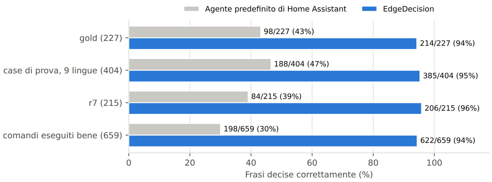
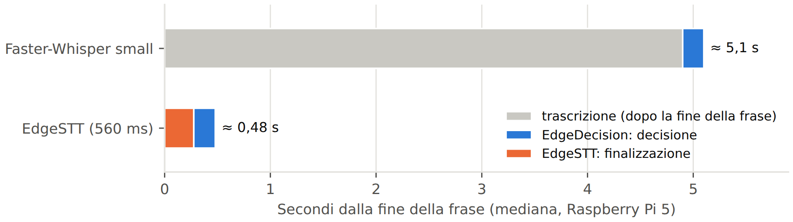

# EdgeDecision

**Controllo vocale locale per Home Assistant su Raspberry Pi 5: niente frasi fisse, niente cloud, niente LLM.**

Questo repository contiene due add-on di Home Assistant che lavorano insieme:

- **EdgeSTT**: riconoscimento vocale in streaming (NVIDIA Nemotron 3.5 ASR, 9 lingue) che trascrive *mentre* parli;
- **EdgeDecision**: un piccolo motore decisionale che capisce cosa vuoi e agisce sulla casa;

più l'**integrazione EdgeDecision** (HACS), che rende EdgeDecision l'agente di conversazione di Assist.

```
Voice PE ──audio──▶ EdgeSTT ──testo──▶ EdgeDecision ──azione──▶ Home Assistant ──risposta──▶ Piper
           (riconoscimento in streaming)   (decide: esegue · chiede · rifiuta · passa oltre)
```

[English](README.md) · [Paper (IT)](docs/EdgeDecision_paper_IT.pdf) · [Paper (EN)](docs/EdgeDecision_paper_EN.pdf) ·
[Benchmark](docs/BENCHMARKS.md)

EdgeDecision sta tra il riconoscimento vocale e Home Assistant. Legge la frase che hai detto ("abbassa un po' la luce
della cucina", "could you turn the living room lamp on please", "wie spät ist es?"), la confronta con quello che la
*tua* casa sa fare e decide in una frazione di secondo se **eseguire**, **chiedere** ("Intendi la TV della cucina o
quella del salone?"), **rifiutare** o **passare la richiesta a un altro assistente**.

- **Gira su un Raspberry Pi 5**: una sola rete neurale da 24 MB; insieme a EdgeSTT, circa mezzo secondo dalla fine
  della frase alla decisione (mediana, misurata sul Pi).
- **Non è vincolato a frasi fisse**: parli in modo naturale, con le tue parole. Sulle stesse 846 frasi di prova
  l'agente predefinito di Home Assistant ne ha capite il 44%, EdgeDecision il 95% ([dettagli](docs/BENCHMARKS.md)).
- **Sicuro per costruzione**: è un modello che *decide*, non che genera testo. Non può inventare azioni; se non è
  sicuro chiede; sbloccare porte, aprire il garage e disinserire l'allarme vengono sempre confermati. Zero esecuzioni
  sbagliate sui set di prova.
- **9 lingue**: italiano, inglese, spagnolo, francese, tedesco, olandese, portoghese, polacco, svedese, con un solo
  modello.
- **La tua casa, letta al momento**: dispositivi, stanze, piani e alias arrivano da Home Assistant; i dispositivi
  nuovi o rinominati vengono letti entro un minuto, senza riaddestrare nulla.
- **100% locale**: niente esce dalla tua rete.

## Il paper in breve

*EdgeDecision ed EdgeSTT: controllo vocale locale per Home Assistant con un piccolo modello decisionale non
generativo e riconoscimento vocale in streaming* — Luca Baratti, rapporto tecnico 1.0, ottobre 2026.
**[PDF (italiano)](docs/EdgeDecision_paper_IT.pdf)** · [PDF (English)](docs/EdgeDecision_paper_EN.pdf) ·
[versione inglese da leggere online](docs/PAPER.md)

EdgeDecision tratta il controllo vocale come una *scelta* tra le capacità che esistono davvero nella tua casa, non
come generazione di testo. Un cross-encoder di 23,9 milioni di parametri (ricavato da `multilingual-e5-small` con
riduzione del vocabolario, potatura degli strati, distillazione da un insegnante di 568 milioni di parametri e
quantizzazione INT8: un file di 24 MB) assegna un punteggio a ogni azione possibile e a un candidato esplicito
«nessuna azione»; una politica calibrata decide se eseguire, chiedere, rifiutare o passare la richiesta. EdgeSTT
esegue NVIDIA Nemotron 3.5 ASR in streaming sul Raspberry Pi 5, così la frase viene trascritta mentre parli.

Su 846 frasi di prova scritte a mano in nove lingue EdgeDecision decide correttamente il 95%, senza esecuzioni
sbagliate; l'agente predefinito di Home Assistant, sulle stesse frasi, il 44%:



Su un Raspberry Pi 5 con un satellite Voice PE, dalla fine della frase alla decisione passa circa mezzo secondo:



## Perché

Gli assistenti vocali locali di oggi sono **veloci ma rigidi** (corrispondenza con modelli di frase: la frase deve
combaciare con uno schema scritto prima) oppure **flessibili ma lenti e pesanti** (un LLM che deve generare una
risposta, spesso su GPU o nel cloud). EdgeDecision segue una terza strada, ispirata al "Sistema 1" delle teorie a doppio
processo: un modello piccolo e veloce che riconosce *cosa vuoi* tra le azioni che la tua casa offre davvero, più regole
deterministiche per numeri, orari e sicurezza. Quello che non sa gestire (chiacchiere, richieste complesse) passa
all'agente che scegli tu (quello di Home Assistant o un LLM).

## Come funziona

```
frase + stanza del microfono                   la tua casa (dispositivi, stanze, stati, azioni), letta al momento
        │                                                    │
        ▼                                                    ▼
 ricerca: le 12 azioni candidate più probabili (n-grammi di caratteri + embedding dello stesso modello)
        ▼
 piccolo cross-encoder multilingue (6 strati, INT8): punteggio di ogni coppia (frase, azione) + tipo di richiesta
        ▼
 policy calibrata: confidenza, margine, ambiguità, rischio  →  EXECUTE · CLARIFY · REJECT · ESCALATE
        ▼
 parametri deterministici (numeri, percentuali, temperature, durate, orari, colori) e risposte in 9 lingue
```

Tutta la storia (dati, addestramento, distillazione, calibrazione, risultati e limiti) è nel
[paper](docs/EdgeDecision_paper_IT.pdf).

## EdgeSTT, il riconoscimento vocale

I riconoscitori come Whisper iniziano a lavorare solo quando smetti di parlare: su un Raspberry Pi 5, nei nostri test
Faster-Whisper small impiegava circa 5 secondi per un comando breve. EdgeSTT usa **NVIDIA Nemotron 3.5 ASR Streaming
0.6B** (INT8, con sherpa-onnx) ed elabora l'audio a blocchi da 560 ms *mentre* parli, a circa un terzo del tempo reale
sul Pi 5: quando smetti resta da calcolare solo l'ultimo blocco. Aggiunge silenzio all'inizio e un flush
deterministico alla fine, così la prima e l'ultima parola non si perdono. Stesse 9 lingue di EdgeDecision; parla con
Assist tramite il protocollo Wyoming. Dettagli: [documentazione di EdgeSTT](edgestt/DOCS.md).

## Installazione

Serve Home Assistant OS o Supervised (per gli add-on) e una sintesi vocale per Assist (per esempio Piper).

1. **Add-on**: Impostazioni → Componenti aggiuntivi → Store → ⋮ → Repository → aggiungi
   `https://github.com/Lucapgt/edgedecision`. Installa **EdgeSTT**, avvialo (al primo avvio scarica il modello, circa 475 MB)
   e accetta l'integrazione Wyoming che Home Assistant scopre. Poi installa **EdgeDecision**. Nella configurazione imposta `mode: homeassistant`
   (il valore iniziale `demo` usa una casa di prova interna e non comanda nulla) e avvialo. La prima installazione
   richiede qualche minuto.
2. **Integrazione**: in HACS → ⋮ → Repository personalizzati → aggiungi `https://github.com/Lucapgt/edgedecision` (tipo
   *Integrazione*) → installa **EdgeDecision**, riavvia Home Assistant, poi Impostazioni → Dispositivi e servizi →
   Aggiungi integrazione → EdgeDecision.
3. **Assist**: Impostazioni → Assistenti vocali → il tuo assistente → *Riconoscimento vocale*: **EdgeSTT**,
   *Agente di conversazione*: **EdgeDecision**, lingua = quella che parli.
   Nelle opzioni dell'integrazione scegli un agente di riserva (per esempio *Home Assistant*): riceve quello che
   EdgeDecision passa oltre.
4. Esponi ad Assist i dispositivi che vuoi comandare (Impostazioni → Assistenti vocali → Esponi).

Opzioni dell'add-on: `model`, `threads` (Pi 5: 4), `lang` (lingua predefinita delle risposte; Assist manda la sua),
`expose_all`, `allow_off_all` ("spegni tutto" spegne davvero la casa; spento di default), `save_history` (salva le
decisioni in `/share/edgedecision/history.jsonl`; spento di default).

## Cosa capisce

Luci (accensione, luminosità, colore, temperatura), prese, tapparelle e tende (posizione, lamelle), clima
(temperatura, modalità, preset), ventilatori, umidificatori, scaldabagni, valvole, serrature, allarmi, lettori
multimediali (play, pausa, volume, sorgenti, musica per nome con Music Assistant), robot aspirapolvere e tosaerba,
scene, script, automazioni, pulsanti; domande sullo stato di dispositivi, stanze, piani e casa ("ci sono finestre
aperte?", "chi è a casa?"); meteo; timer, sveglie e annunci sul satellite vocale; liste della spesa; "che ore sono?",
"dove sei?", "cosa hai appena fatto?". Più comandi nella stessa frase ("accendi la luce della cucina e chiudi le
tapparelle") vengono separati e verificati uno per uno.

## Limiti

- Solo 9 lingue; in EdgeDecision spagnolo e inglese sono un po' più deboli delle altre, nel modello vocale polacco e
  svedese.
- EdgeDecision è addestrato a reggere errori di riconoscimento simulati con Whisper; quelli di Nemotron sono diversi
  (addestrarlo sugli errori di EdgeSTT è il primo miglioramento previsto).
- Le risposte molto brevi ("cucina") a volte escono vuote dal riconoscimento vocale; EdgeDecision allora richiede.
- Decide tra le azioni della tua casa: non conversa, e le richieste complesse ("accendi il riscaldamento quando arrivo
  a casa") vanno all'agente di riserva.
- I nomi dei dispositivi contano: "SHIELD Android TV" è più facile di `media_player.shield_2` (indirizzi IP e sigle
  tecniche vengono tolti in automatico).

## Licenza

EdgeDecision è **a sorgente disponibile per uso non commerciale**, non open source nel senso OSI:

- codice di EdgeDecision, EdgeSTT e dell'integrazione: [PolyForm Noncommercial 1.0.0](LICENSE);
- modello di EdgeDecision e documentazione: [CC BY-NC 4.0](LICENSE-MODEL);
- il modello vocale usato da EdgeSTT **non** fa parte di questo repository: è NVIDIA Nemotron 3.5 ASR Streaming 0.6B,
  scaricato al primo avvio e concesso da NVIDIA con licenza [OpenMDW-1.1](LICENSE-OpenMDW-1.1.txt) (vedi
  [NOTICE](NOTICE));
- componenti di terze parti e provenienza del materiale di addestramento:
  [THIRD_PARTY_LICENSES.md](THIRD_PARTY_LICENSES.md).

Sono benvenuti l'uso personale, hobbistico, di ricerca e didattico. L'uso commerciale non è consentito.

I dati e gli strumenti di addestramento non sono pubblicati.
