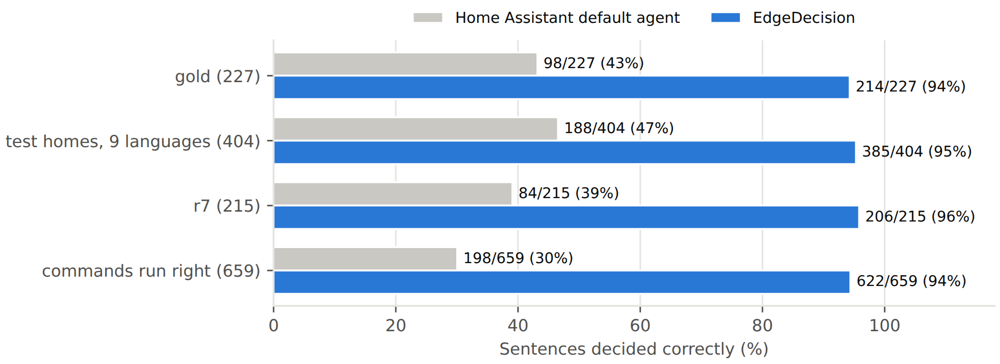
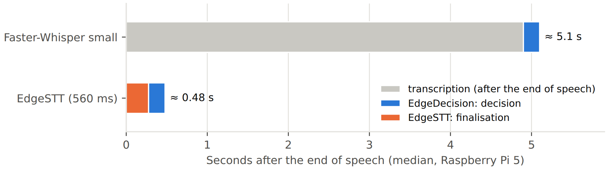

# EdgeDecision

**Local voice control for Home Assistant on a Raspberry Pi 5 — no fixed phrases, no cloud, no LLM.**

This repository contains two Home Assistant add-ons that work together:

- **EdgeSTT** — streaming speech-to-text (NVIDIA Nemotron 3.5 ASR, 9 languages) that transcribes *while* you speak;
- **EdgeDecision** — a small decision engine that understands what you want and acts on your home;

plus the **EdgeDecision integration** (HACS) that makes EdgeDecision the conversation agent of Assist.

```
Voice PE ──audio──▶ EdgeSTT ──text──▶ EdgeDecision ──action──▶ Home Assistant ──reply──▶ Piper
           (streaming speech recognition)  (decide: execute · ask · refuse · pass on)
```

[Italiano](README.it.md) · [Paper (online)](docs/PAPER.md) · [Paper (EN, PDF)](docs/EdgeDecision_paper_EN.pdf) · [Paper (IT)](docs/EdgeDecision_paper_IT.pdf) ·
[Benchmarks](docs/BENCHMARKS.md)

EdgeDecision sits between speech recognition and Home Assistant. It reads the sentence you said ("abbassa un po' la
luce della cucina", "could you turn the living room lamp on please", "wie spät ist es?"), compares it with what *your*
home can do, and decides in a fraction of a second whether to **execute**, **ask** ("Do you mean the kitchen TV or the
living room TV?"), **refuse**, or **pass the request to another assistant**.

- **Runs on a Raspberry Pi 5**: one 24 MB neural network; together with EdgeSTT, about half a second from the end
  of your sentence to the decision (median, measured on the Pi).
- **Not tied to fixed phrases**: you speak naturally, in your own words. On the same 846 test sentences Home
  Assistant's default agent understood 44%, EdgeDecision 95% ([details](docs/BENCHMARKS.md)).
- **Safe by design**: it is a *decision* model, not a text generator. It cannot invent actions; when unsure it asks;
  unlocking doors, opening the garage and disarming the alarm are always confirmed. Zero wrong executions on the test
  sets.
- **9 languages**: Italian, English, Spanish, French, German, Dutch, Portuguese, Polish, Swedish — one model.
- **Your home, read at runtime**: devices, rooms, floors and aliases come from Home Assistant; new or renamed devices
  are picked up within a minute, without retraining.
- **100% local**: nothing leaves your network.

## The paper in brief

*EdgeDecision and EdgeSTT: local voice control for Home Assistant with a small non-generative decision model and
streaming speech recognition* — Luca Baratti, technical report 1.0, October 2026.
**[Read it online](docs/PAPER.md)** · [PDF (English)](docs/EdgeDecision_paper_EN.pdf) ·
[PDF (italiano)](docs/EdgeDecision_paper_IT.pdf)

EdgeDecision treats voice control as a *choice* among the capabilities that really exist in your home, not as text
generation. A 23.9-million-parameter cross-encoder (derived from `multilingual-e5-small` by vocabulary reduction,
layer pruning, distillation from a 568-million-parameter teacher and INT8 quantization: a 24 MB file) scores every
candidate action plus an explicit "no action", and a calibrated policy decides whether to execute, ask, refuse or
pass the request on. EdgeSTT runs NVIDIA Nemotron 3.5 ASR in streaming on the Raspberry Pi 5, so the sentence is
transcribed while you speak.

On 846 hand-written test sentences in nine languages, EdgeDecision decides 95% correctly with no wrong execution;
Home Assistant's default agent, on the same sentences, 44%:



On a Raspberry Pi 5 with a Voice PE satellite, from the end of the sentence to the decision takes about half a second:



## Why

Local voice assistants today are either **fast but rigid** (template matching: a sentence must match a pattern
written in advance) or **flexible but slow and heavy** (an LLM that must generate an answer, often on a GPU or in the
cloud). EdgeDecision takes a third path, inspired by the "System 1" of dual-process theories: a small, fast model that
recognises *what you want* among the actions your home actually offers, plus deterministic rules for numbers, times
and safety. Anything it cannot handle — chit-chat, complex requests — goes to the agent you choose (Home Assistant's
own, or an LLM).

## How it works

```
sentence + room of the microphone              your home (devices, rooms, states, actions) — read at runtime
        │                                                    │
        ▼                                                    ▼
 retrieval: top 12 candidate actions (character n-grams + embeddings of the same model)
        ▼
 small multilingual cross-encoder (6 layers, INT8): score of every (sentence, action) pair + kind of request
        ▼
 calibrated policy: confidence, margin, ambiguity, risk  →  EXECUTE · CLARIFY · REJECT · ESCALATE
        ▼
 deterministic parameters (numbers, percentages, temperatures, durations, times, colours) and replies in 9 languages
```

The full story — data, training, distillation, calibration, results and limits — is in the
[paper](docs/EdgeDecision_paper_EN.pdf).

## EdgeSTT, the speech recognition

Speech recognisers such as Whisper start working only when you stop talking: on a Raspberry Pi 5, Faster-Whisper
small needed about 5 seconds for a short command in our tests. EdgeSTT runs **NVIDIA Nemotron 3.5 ASR Streaming
0.6B** (INT8, through sherpa-onnx) and processes the audio in 560 ms blocks *while* you speak, at about a third of real
time on the Pi 5, so only the last block is left when you stop. It adds silence at the start and a deterministic flush
at the end, so the first and the last word are not lost. Same 9 languages as EdgeDecision; it talks to Assist through
the Wyoming protocol. Details: [EdgeSTT documentation](edgestt/DOCS.md).

## Install

You need Home Assistant OS or Supervised (for the add-ons) and a text-to-speech engine for Assist (e.g. Piper).

1. **Add-ons**: Settings → Add-ons → Add-on store → ⋮ → Repositories → add
   `https://github.com/Lucapgt/edgedecision`. Install **EdgeSTT**, start it (the first start downloads the ~475 MB model) and
   accept the Wyoming integration Home Assistant discovers. Then install **EdgeDecision**. In its configuration set `mode: homeassistant`
   (the default `demo` uses a built-in test home and controls nothing) and start it. The first build takes a few
   minutes.
2. **Integration**: in HACS → ⋮ → Custom repositories → add `https://github.com/Lucapgt/edgedecision` (type *Integration*) →
   install **EdgeDecision**, restart Home Assistant, then Settings → Devices & services → Add integration →
   EdgeDecision.
3. **Assist**: Settings → Voice assistants → your assistant → *Speech-to-text*: **EdgeSTT**, *Conversation agent*:
   **EdgeDecision**, language = the language you speak. Choose a
   fallback agent in the integration options (e.g. *Home Assistant*): it receives what EdgeDecision passes on.
4. Expose to Assist the devices you want to control (Settings → Voice assistants → Expose).

Add-on options: `model`, `threads` (Pi 5: 4), `lang` (default reply language; Assist sends its own), `expose_all`,
`allow_off_all` ("turn everything off" really switches off the house; off by default), `save_history` (keep a log of
decisions in `/share/edgedecision/history.jsonl`; off by default).

## What it understands

Lights (on/off, brightness, colour, temperature), switches, covers and blinds (position, tilt), climate (temperature,
mode, presets), fans, humidifiers, water heaters, valves, locks, alarm panels, media players (play, pause, volume,
sources, music by name through Music Assistant), vacuums, lawn mowers, scenes, scripts, automations, buttons; questions
about states, rooms, floors and the whole house ("are any windows open?", "who is home?"); weather; timers, alarms and
announcements on the voice satellite; shopping lists; "what time is it?", "where are you?", "what did you just do?".
Several commands in one sentence ("turn on the kitchen light and close the shutters") are split and checked one by
one.

## Limits

- 9 languages only; Spanish and English are slightly weaker than the others in EdgeDecision, Polish and Swedish in
  the speech model.
- EdgeDecision was trained to cope with speech-recognition errors simulated with Whisper; the errors of Nemotron are
  different (training on EdgeSTT's own errors is the first planned improvement).
- Very short answers ("kitchen") can come out empty from the speech recogniser; EdgeDecision then asks again.
- It decides among the actions of your home: it does not chat, and complex requests ("turn on the heating when I get
  home") go to the fallback agent.
- Device names matter: "SHIELD Android TV" is easier than `media_player.shield_2` (IP addresses and technical tags are
  removed automatically).

## Licence

EdgeDecision is **source-available for non-commercial use**, not open source in the OSI sense:

- code of EdgeDecision, EdgeSTT and the integration: [PolyForm Noncommercial 1.0.0](LICENSE);
- EdgeDecision model and documentation: [CC BY-NC 4.0](LICENSE-MODEL);
- the speech model used by EdgeSTT is **not** part of this repository: it is NVIDIA Nemotron 3.5 ASR Streaming 0.6B,
  downloaded at the first start and licensed by NVIDIA under [OpenMDW-1.1](LICENSE-OpenMDW-1.1.txt) (see
  [NOTICE](NOTICE));
- third-party components and the provenance of the training material: [THIRD_PARTY_LICENSES.md](THIRD_PARTY_LICENSES.md).

Personal, hobby, research and educational use are welcome. Commercial use is not permitted.

The training data and the training tools are not published.
