# EdgeDecision and EdgeSTT: local voice control for Home Assistant with a small non‑generative decision model and streaming speech recognition

**Luca Baratti** · Technical report, version 1.0 · 4 October 2026

[PDF (English)](EdgeDecision_paper_EN.pdf) · [PDF (italiano)](EdgeDecision_paper_IT.pdf) · [Benchmarks](BENCHMARKS.md) · [Back to the project](../README.md)

**Contents:** [1. Where the project comes from](#1-where-the-project-comes-from) · [2. Introduction](#2-introduction) · [3. Related work](#3-related-work) · [4. Problem formulation](#4-problem-formulation) · [5. System architecture](#5-system-architecture) · [6. EdgeSTT: streaming speech recognition](#6-edgestt-streaming-speech-recognition) · [7. From voice command to action: who does what](#7-from-voice-command-to-action-who-does-what) · [8. A worked example: from words to decision](#8-a-worked-example-from-words-to-decision) · [9. The model](#9-the-model) · [10. Data](#10-data) · [11. How we obtained the e5s-6L model](#11-how-we-obtained-the-e5s-6l-model) · [12. Results](#12-results) · [13. The fifth round: nine languages](#13-the-fifth-round-nine-languages) · [14. The sixth round: weather and music by name](#14-the-sixth-round-weather-and-music-by-name) · [15. The seventh round: the whole house, second homes, timers](#15-the-seventh-round-the-whole-house-second-homes-timers) · [16. Software 0.8: from the tests at home](#16-software-08-from-the-tests-at-home) · [17. Comparison with Home Assistant's default agent](#17-comparison-with-home-assistants-default-agent) · [18. The whole chain on a Raspberry Pi 5](#18-the-whole-chain-on-a-raspberry-pi-5) · [19. Licences](#19-licences) · [20. Discussion and limitations](#20-discussion-and-limitations) · [21. Conclusions](#21-conclusions)

## Abstract

Voice commands at home need decisions that are fast, reliable and private. Generative language models are flexible but slow and heavy for edge hardware such as a Raspberry Pi and do not guarantee cautious behaviour; template-based systems are fast but rigid. We present two local components for Home Assistant that work together. **EdgeDecision** treats understanding as *choice* rather than generation: for every sentence it scores the capabilities that actually exist in the home (for example “turn on · TV taverna”) and an explicit “no action” candidate, and produces one of four decisions: execute, ask for clarification, reject, or pass the request to another agent. Its core is **e5s-6L**, a 23.9-million-parameter cross-encoder derived from `multilingual-e5-small` (Microsoft, MIT licence) by vocabulary reduction, layer pruning from 12 to 6, four heads, distillation from a 568-million-parameter teacher and INT8 quantization (24.3 MB), trained only on synthetic data in nine languages. **EdgeSTT** brings streaming speech recognition with NVIDIA Nemotron 3.5 ASR (0.6 billion parameters, INT8) to the Raspberry Pi 5 through sherpa-onnx and the Wyoming protocol: the audio is transcribed while the user speaks, and at the end of the sentence only the last block is left. With the model resulting from the seventh round (7c) and the 1.0 software, EdgeDecision decides 805 of 846 hand-written sentences correctly (95%) in nine languages, with no wrong execution and always confirming high-risk actions; on the same sentences Home Assistant's default agent decides 370 correctly (44%) and runs 15 high-risk actions without asking. On a Raspberry Pi 5 with a Voice PE satellite, the chain from the end of speech to the decision takes about 0.48 s at the median (276 ms to finish the transcription and 203 ms to decide), while the transcription alone took about 5 s with Faster-Whisper small.

## 1. Where the project comes from

**The idea: a “System 1” model.** On 15 September 2026 TypeSafe AI presented Jev, a model that neither converses nor writes text. It receives a state and a question and returns a choice, a grade or a probability, with its confidence. Its founder described it as a “System 1” model, borrowing Daniel Kahneman's distinction between two modes of thinking. System 1 is fast, automatic and intuitive: recognising a face, telling that the pasta is cooked. System 2 is slow, deliberate and effortful: doing a sum, planning a trip. A generative language model handles every request like System 2, even the most trivial one, because it reasons by writing one token after another. A System 1 model only weighs alternatives that are already known, and it can weigh them all at once. A few days after Jev, CLM-8B appeared, an open model built on the same principle.

**The question.** Jev is a cloud service and CLM-8B needs a GPU. This is where the question comes from: can a System 1 model specialised in a single domain become small enough to run at home, on a Raspberry Pi, without losing reliability? Home automation is a good fit, because almost everything people ask a home voice assistant is a System 1 decision. “Turn on the kitchen light” requires no reasoning: it requires picking the right thing among the few hundred things the home can do.

**The problem to solve.** Anyone who controls Home Assistant by voice today has to pick between two compromises:

- **Sentence-template matching** (built into Home Assistant): fast and local, but it only understands the phrasings it expects. A sentence like “put the living-room light to maximum”, or a single speech-recognition error, is enough to lose it.
- **An LLM agent**: it understands free phrasing. Run locally, though, it takes seconds on a Raspberry Pi and needs gigabytes of memory. Run in the cloud, it depends on the network, costs money per request and sends what is said at home out of the home. Either way, because it generates text, it can invent a device or an action that does not exist.

The goal is therefore a system that is **fast** (an answer in under a quarter of a second), **local** (it works without internet and keeps the sentences at home), **safe** (it never executes the wrong action on a lock or a gate, and asks when it is unsure) and **multilingual**. The last point matters for homes with guests who speak other languages: second homes, holiday rentals, hotels.

**The division of labour.** EdgeDecision is the System 1 of the home. It decides direct commands and state questions on its own, and these are the vast majority. When a request needs System 2 (a condition such as “if it rains tomorrow close the curtains”, an open question, a conversation), it recognises it as such and hands it to an LLM or to the Home Assistant agent. It does not have to do everything: it has to be fast and safe on what belongs to it, and honest about what does not. Some examples:

- “turn on the kitchen light”, “is the bathroom window open?”, “play radio deejay in the living room”: System 1, EdgeDecision executes or answers in about two tenths of a second on the Raspberry Pi;
- “turn on the TV” with two TVs and the microphone in a room without one: it asks which (CLARIFY);
- “open the front door”: it asks for confirmation, because the action is risky;
- “if it rains tomorrow close the curtains”, “suggest a recipe”: System 2, the sentence goes to the LLM (ESCALATE).

**The voice.** The first tests on the Raspberry Pi showed that, once the decision was fast, the time was lost elsewhere: in speech recognition. Faster-Whisper small, the local engine most used with Home Assistant, needed about 5 seconds to transcribe a short command, because it starts working only when the user has finished speaking. Next to EdgeDecision we therefore built EdgeSTT, an add-on that uses a streaming speech model and transcribes *while* the user speaks. This report describes both: version 1.0 publishes them together, in the same repository, with the integration that makes EdgeDecision the conversation agent of Assist.

## 2. Introduction

A home voice assistant must turn a sentence such as “lower the kitchen shutter a bit” into a precise call to a home service. Available solutions fall into two families. **Template-based systems** (such as the intent recognizer built into Home Assistant) are fast and predictable, but recognise only the expected phrasings and cope poorly with speech-recognition errors. **Generative language models** (LLMs) understand free phrasing, but on a Raspberry Pi they take seconds per answer, use gigabytes of memory and, since they generate text, can invent an action or a device that does not exist.

EdgeDecision follows a third path: it treats the problem as a **choice among known alternatives**. The home catalogue is turned into a list of *capabilities* (an action on a target, for example “set position · Tapparella cucina”) and a small neural model scores each of them. The model generates nothing: it can only prefer an existing capability or the special “no action” candidate. On top of the scores, a calibrated policy decides whether to execute, ask, reject or delegate, favouring caution: asking for confirmation costs a second, executing the wrong action can cost much more. Figure 1 compares the two approaches on a real example.

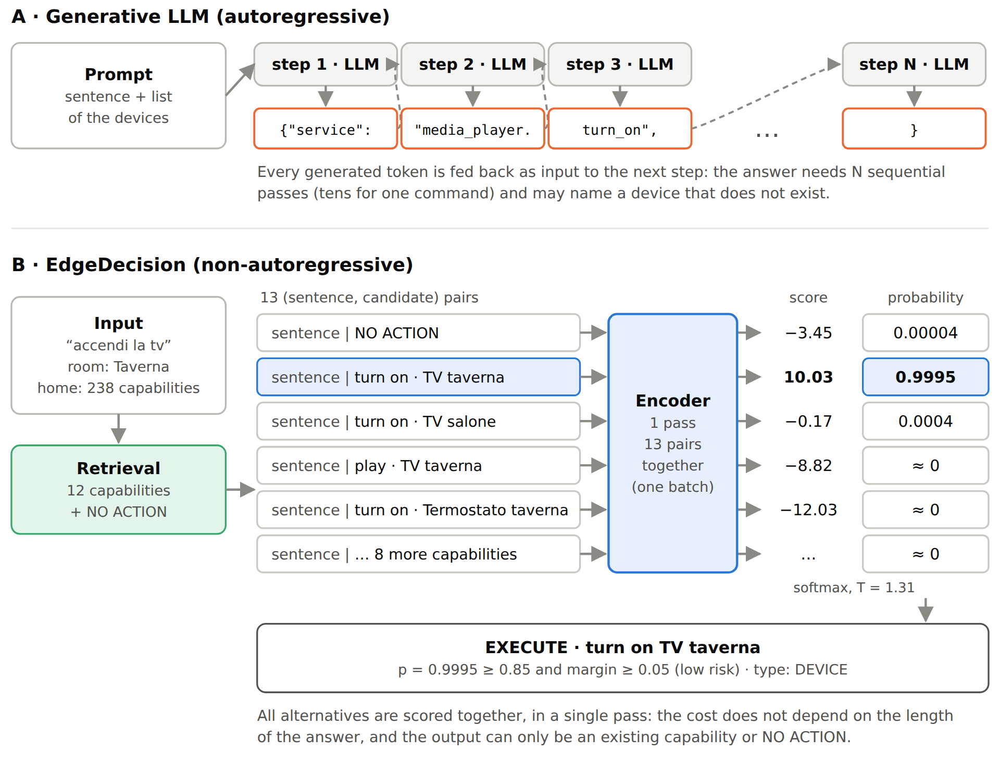

***Figure 1.** Autoregressive generation versus parallel choice. (A) An LLM writes the answer one token at a time and every step depends on the previous one (the tokens are an example). (B) EdgeDecision builds one (sentence, candidate) pair for each of the 12 retrieved capabilities plus NO ACTION and scores them all together in a single encoder pass; a softmax turns the scores into probabilities and the policy decides. Scores and probabilities are the real ones of the 6-layer model for “accendi la tv” (turn on the tv) said in the basement of the test home. Candidate retrieval needs one more encoder pass, on the sentence alone.*

The contributions of this work are:

- a formulation of voice control as ranking of the capabilities present *at runtime*, with an explicit “no action” candidate and four outcomes (EXECUTE, CLARIFY, REJECT, ESCALATE);
- a single network with four heads (score, request type, retrieval embedding, word tags), exported to one ONNX graph that runs without PyTorch;
- a procedure that goes from a 568 M-parameter teacher to a 23.9 M-parameter student (e5s-6L, 6 layers; up to round 5 also a 4-layer variant) through synthetic data, verified paraphrases, distillation, vocabulary and layer pruning, INT8 quantization and calibration;
- EdgeSTT, a streaming speech-recognition add-on for the Raspberry Pi 5, with silence added at the start and a deterministic flush at the end, which brings the chain from the end of speech to the decision to about half a second;
- an evaluation on hand-written sets in nine languages, on synthetic data and in the field, with a Raspberry Pi 5, a Voice PE satellite and Home Assistant, and a comparison with Home Assistant's default agent on the same 846 sentences with the same scoring.

## 3. Related work

**Cross-encoder re-ranking.** Scoring query and document together with a Transformer, instead of comparing two separately computed vectors, is the standard technique for re-ranking search results. EdgeDecision applies it to very short “documents”: the textual descriptions of the home's capabilities. Since the output space is text, adding a device does not require retraining the model.

**Compact multilingual models.** The student starts from `multilingual-e5-small`, a 12-layer, 384-dimensional encoder trained for sentence embeddings in about 100 languages, which uses the SentencePiece vocabulary of XLM-RoBERTa. The teacher is `bge-reranker-v2-m3`, a multilingual cross-encoder of the BGE-M3 family.

**Compression.** Knowledge distillation trains a small model to imitate the distributions of a large one. Removing layers from a pre-trained Transformer and then fine-tuning it retains most of the accuracy. Temperature scaling makes probabilities interpretable, a prerequisite for safety thresholds.

**“System 1” decision models.** As described at the beginning, in September 2026 general models that score choices instead of generating text were presented, such as Jev (a commercial cloud service) and CLM-8B (8 billion parameters, open, for GPUs). EdgeDecision shares the principle but is specialised in a single domain, about 400 times smaller than CLM-8B, and runs locally on a Raspberry Pi. We have not compared the three systems experimentally.

**Streaming speech recognition.** Whisper is an encoder–decoder model that transcribes a complete audio segment: in a voice assistant the computation starts only after the sentence. Models with an RNN-T transducer instead emit text as the audio arrives. FastConformer reduces the cost of the Conformer encoder, and its *cache-aware* variant makes it suitable for streaming by keeping the state of the layers from one block to the next instead of recomputing the context. Nemotron 3.5 ASR Streaming 0.6B is a multilingual model of this kind, which EdgeSTT runs with the sherpa-onnx runtime.

**Template-based understanding.** Home Assistant's default conversation agent recognises intents with the `hassil` library, matching the sentence against the templates of the `home-assistant-intents` project, written by hand by the community for each language. It is the baseline we compare EdgeDecision with in the section “Comparison with Home Assistant's default agent”.

## 4. Problem formulation

The input is a sentence *u* (the text produced by speech recognition), the microphone area *a*, if known, and the home catalogue *C*: areas, entities with name, aliases, class and state, and the actions each of them supports. From the catalogue we derive the set of capabilities *K* = {*k*1, …, *k*n}; each capability is an `action@target` pair, where the target is an entity (`light.lampada_arco`) or a group (“all lights in the living room”). The test home used in our experiments has 51 entities and about 238 capabilities.

Each capability is rendered as text, in English and with the original device names, for example:

    media player turn on: turn on a TV / speaker / media player || target: TV taverna (media player tv) || area: Taverna || state: off

The candidate `NO_ACTION` (“none of the available actions matches this request”) is added, so the model is never forced to pick a device. The output is a decision *d* ∈ {EXECUTE, CLARIFY, REJECT, ESCALATE}, with the chosen capability, the parameters (percentages, degrees, colours…) and a calibrated confidence. Table 1 shows real decisions in the test home, whose device names are Italian.

***Table 1.** Example decisions in the test home (scenarios verified on the Raspberry Pi). Sentences in Italian, with an English gloss.*

| Sentence (microphone room)                                                            | Decision | Effect                                             |
|---------------------------------------------------------------------------------------|----------|----------------------------------------------------|
| accendi le luci del salone *(turn on the living-room lights)*                         | EXECUTE  | turns on both living-room lights                   |
| spegni la tv *(turn off the tv)*, in Taverna                                          | EXECUTE  | turns off the basement TV, not the living-room one |
| accendi la tv *(turn on the tv)*, room unknown, two TVs                               | CLARIFY  | “Do you mean TV salone or TV taverna?”             |
| apri il portoncino *(unlock the front door)*                                          | CLARIFY  | asks for confirmation: high-risk action            |
| imposta il termostato della zona giorno *(set the living-area thermostat)*            | CLARIFY  | asks for the missing value                         |
| non accendere la luce del box *(do not turn on the garage light)*                     | REJECT   | does nothing (negation)                            |
| chiudi il velux e accendi il climatizzatore *(close the skylight and turn on the AC)* | EXECUTE  | two commands executed                              |
| se piove chiudi la tenda del terrazzo *(if it rains close the terrace awning)*        | ESCALATE | conditional rule: handed over to an LLM            |

## 5. System architecture

Figure 2 shows the path of a sentence. The neural network computes the scores in step 4 and the embeddings used by retrieval in step 3; the other steps are deterministic and serve to protect, explain and complete the model's decision.

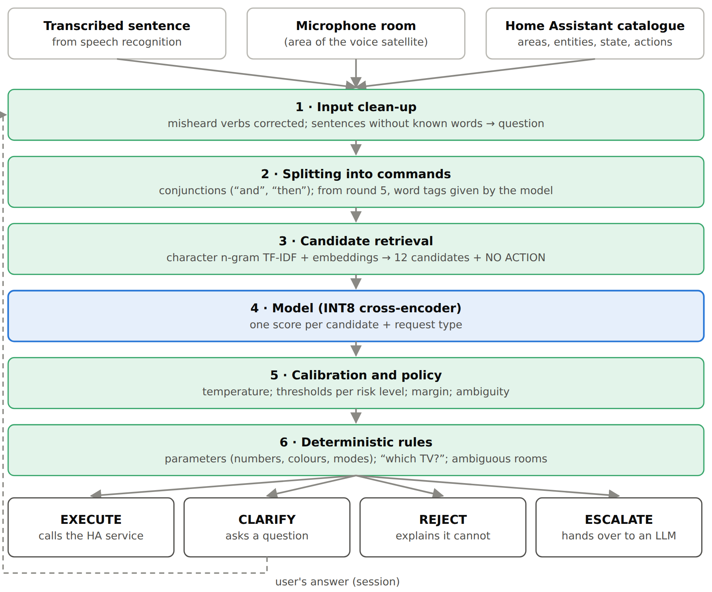

***Figure 2.** Runtime path of a sentence. Blue: the neural model; green: deterministic steps of the EdgeDecision software. A question (CLARIFY) opens a session tied to the voice satellite: the user's answer (“the one in the basement”, “yes”, “to 40%”) is interpreted in the context of the question.*

### 5.1 Candidate retrieval

To avoid scoring hundreds of capabilities for every sentence, a hybrid retriever selects 12 of them. It combines a TF-IDF index over character 3- and 4-grams, robust to typing and transcription errors, with the cosine similarity between the sentence embedding and the capability embeddings. Capability embeddings do not contain state and are recomputed only when the catalogue changes, so each sentence needs a single encoder pass. Retrieval contains the correct capability for 99.9% of validation sentences and 100% of gold sentences. Section 8 shows the complete procedure on an example, with the real numbers.

### 5.2 Score and request type

The model scores the (sentence, capability) pairs and produces a score for each candidate; the (sentence, `NO_ACTION`) pair also feeds a second head that classifies the request as a device command (DEVICE), out of domain (OUT_OF_DOMAIN), complex (COMPLEX, e.g. a condition or a scheduled action) or no action (NOOP, e.g. a negation). The fifth round adds CONFIRM (an answer such as “yes”) and HISTORY (“what did you do?”).

### 5.3 Calibration and decision policy

Candidate scores go through a softmax with temperature *T*, fitted on validation with the INT8 model and the real retriever (for the 6-layer variant *T* = 1.31 in round 4 and 1.52 in round 5). The policy then applies, in order: the request type; ambiguity (if a candidate *incompatible* with the first one exceeds 30% of its probability, the system asks which of the two); probability and margin thresholds, which depend on the risk of the action (Table 2); entity availability and parameter validity. High-risk actions (unlocking a lock, disarming the alarm, opening the garage) always ask for confirmation.

***Table 2.** Execution thresholds chosen by calibration. The system executes only if the calibrated probability and the margin over incompatible alternatives both exceed their thresholds.*

| Action risk | Examples                                                  | Minimum probability | Minimum margin |
|-------------|-----------------------------------------------------------|---------------------|----------------|
| none        | reading a state                                           | 0.70                | 0.00           |
| low         | lights, covers, climate, TV, scenes                       | 0.85                | 0.05           |
| medium      | locking, arming the alarm                                 | 0.95                | 0.17           |
| high        | unlocking; opening garages and gates; disarming the alarm | 0.97 + confirmation | 0.25           |

### 5.4 Deterministic rules

The model decides *what* to do; values are extracted by rules: numbers, also spelled out in words, percentages, degrees, relative changes (“a bit higher” with respect to the current state), colours and modes. Some rules check *which* device is meant: if the sentence contains only a generic noun (“turn on the tv”) and the home has several devices of that kind, the system asks instead of relying on the preference learned by the model; if a word of the sentence belongs to a single candidate (“the island spotlights”) that candidate wins; if a word denotes several rooms (“bathroom” with two bathrooms) the system asks which one. A sentence without any known word (a typical speech-recognition failure) is never executed. Since version 0.8 further rules cover cases seen in real use: a sentence that says to unlock can never lock, a named but absent appliance (the dishwasher) does not turn on another one (the washing machine), an object named in the sentence that is not in the chosen device's name (“skylight” for “Luce mansarda”) leads to a question, and “what time is it?” or “what day is it?” are answered from the Raspberry's clock.

### 5.5 Home Assistant integration

EdgeDecision runs as a Home Assistant add-on (a container with `onnxruntime`, `tokenizers` and `numpy`, no PyTorch). At start-up it reads areas, entities and aliases through the REST and WebSocket APIs, and every 60 seconds it checks whether the catalogue has changed. A custom component registers it as an Assist *conversation agent*: EXECUTE decisions call the services, CLARIFY keeps the microphone open for the answer, ESCALATE passes the sentence to a second agent (for example an LLM), and every decision is published as an event for debugging. The text comes from EdgeSTT, described in the next section, or from any other speech-to-text engine configured in Assist; the integration also passes to the add-on the device of the satellite that heard the sentence, so replies and music go to the right speaker.

## 6. EdgeSTT: streaming speech recognition

EdgeSTT is the second add-on of the project: it turns the audio of the voice satellite into text. It runs NVIDIA Nemotron 3.5 ASR Streaming 0.6B, a *cache-aware* FastConformer model with RNN-T decoding and 600 million parameters, in the ONNX INT8 export prepared by the sherpa-onnx project, and talks to Assist through the Wyoming protocol. It recognises the same nine languages as EdgeDecision; the language comes from Assist with every request and enters the model as a language prompt.

### 6.1 Why streaming

The time that matters to the speaker is the time between the end of the sentence and the answer. A model such as Whisper transcribes only after the sentence, so all of its computation falls into that wait: on the Raspberry Pi 5, in tests made before this project, Faster-Whisper small (INT8) needed about 4.8–5.0 s for a short command and got even simple words wrong (“spegni la TV” → “spenia la tv”). Nemotron instead processes the audio in fixed blocks while the user speaks (Figure 3). With 560 ms blocks the real-time factor (RTF) on the Pi 5 is about 0.34–0.36: every second of speech needs about a third of a second of computation, done while the user is speaking. When the user stops, only the *finalisation* is left: the last one or two blocks.

Smaller blocks cost too much on the Pi (RTF about 0.9–1.0 at 160 ms and 1.8 at 80 ms); 1120 ms blocks halve the RTF (about 0.18–0.22) but lengthen the wait for the last block. The default is 560 ms. A lighter CTC model (Omnilingual ASR 300M, RTF about 0.23 on the Pi) was discarded because it got too many words wrong (“disattiva la TV” → “disativala tivur”). Profiling also shows that the encoder takes about 90% of the time: replacing the RNN-T decoder with a CTC head would save only 4–6%, while the real lever is the block size.

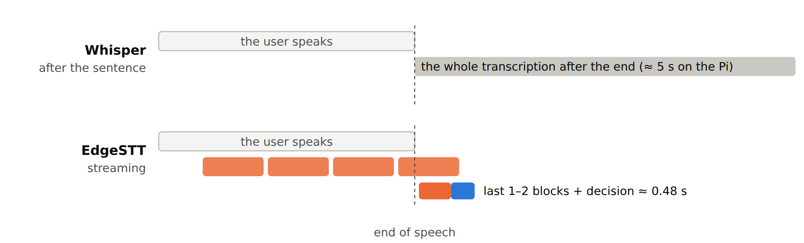

***Figure 3.** Where the computation of speech recognition falls (schematic; indicative time scale). Top: a model that transcribes after the sentence does all its work after the end of speech. Bottom: EdgeSTT processes 560 ms blocks (orange) while the user speaks; after the sentence only the last blocks are left (finalisation, 276 ms median on the Pi 5), followed by EdgeDecision's decision (blue, 203 ms median).*

### 6.2 Start and end of the sentence

Two fixes in the server keep the first and the last word. **At the start**, EdgeSTT adds 300 ms of silence to every request: without it, a word said right after activation was cut (“Alles hat ein Ende…” → “hat ein Ende…”) and an isolated word gave an empty text. **At the end**, the runtime drops the last incomplete block; when the audio ends, the server therefore adds silence until the processed blocks cover all the audio plus 0.3 s, plus about 0.1 s of right context, and only then closes the stream (*deterministic flush*). In a test with 3 recordings and 6 positions of the end of speech relative to the blocks, without the flush the last word was lost in 2 of 18 cases with 560 ms blocks and in 8 of 18 with 1120 ms blocks; with the flush in none.

### 6.3 Accuracy and limits of the model

For 560 ms blocks NVIDIA states a word error rate (WER) on the FLEURS test of 4.4% in Italian, 4.3% in Spanish, 5.7% in Portuguese, 8.0% in English, 8.4% in German, 9.5% in French and 12.0% in Dutch; Polish and Swedish are in the broad-coverage tier, with much lower accuracy. We have not yet measured the WER on real recordings of home commands. On 150 Italian home-automation sentences read by a non-Italian synthetic voice the WER is about 31%: a figure that measures the model and the quality of the synthetic audio together, and should not be read as accuracy on real speakers. The same test does show the behaviours that matter for EdgeDecision: answers of one or two words (“caldaia”, “taverna”) come out empty in 16.7% of cases, numbers can come out as digits or words (“diciannove minuti” → “19 minuti”), and the text contains capitals and punctuation. EdgeDecision accepts all these forms and treats an empty text as “I did not understand”, executing nothing.

***Table 3.** EdgeSTT at a glance. Time and memory measurements are on the Raspberry Pi 5.*

| Item                                               | Value                                                                                          |
|----------------------------------------------------|------------------------------------------------------------------------------------------------|
| Model                                              | NVIDIA Nemotron 3.5 ASR Streaming 0.6B: cache-aware FastConformer with RNN-T, 600 M parameters |
| Format and runtime                                 | ONNX INT8 (sherpa-onnx 1.13.8), greedy decoding on CPU                                         |
| Download at first start / disk space               | about 475 MB / 682 MB                                                                          |
| Blocks                                             | 560 ms (default) or 1120 ms                                                                    |
| RTF                                                | about 0.34–0.36 (560 ms); 0.18–0.22 (1120 ms)                                                  |
| Finalisation, 50 real commands (560 ms, 4 threads) | median 276 ms; 90% under 519 ms                                                                |
| Memory                                             | 1.40 GB                                                                                        |
| Languages                                          | it, en, es, fr, de, nl, pt, pl, sv, plus automatic detection                                   |
| Connection to Home Assistant                       | Wyoming protocol, port 10300                                                                   |

EdgeSTT uses NVIDIA's base model unchanged: training on home commands and short answers is planned but is not part of version 1.0. The model is not included in the repository: the add-on downloads it at the first start from the public sherpa-onnx release.

## 7. From voice command to action: who does what

EdgeDecision is not only the neural model. The model does a single thing, producing scores; everything else is deterministic software written in Python, alongside the Home Assistant components that handle microphone, voice and devices (Figure 4). In short:

- **Home Assistant** receives the audio from the voice satellite (Voice PE), has it transcribed (STT), passes the text to the selected conversation agent, speaks the answer (TTS) and, when asked, turns devices on or off.
- **EdgeSTT**, the second add-on, is the speech recognition: it receives the audio as a stream through Wyoming and returns the text to Assist.
- **The EdgeDecision integration**, a small component installed in Home Assistant, is the conversation agent: it finds the microphone room, sends the sentence to the add-on, receives the answer and returns it to Assist; ESCALATE requests are passed to another agent (for example an LLM).
- **The add-on software** reads the home catalogue, keeps the states up to date, cleans and splits the sentences, selects the candidates, applies the policy and the rules, calls the Home Assistant services and writes the spoken answer.
- **The model** turns a sentence into a vector (for retrieval) and scores the (sentence, candidate) pairs, plus the request type. It does not call services, does not know the thresholds and does not talk to Home Assistant.

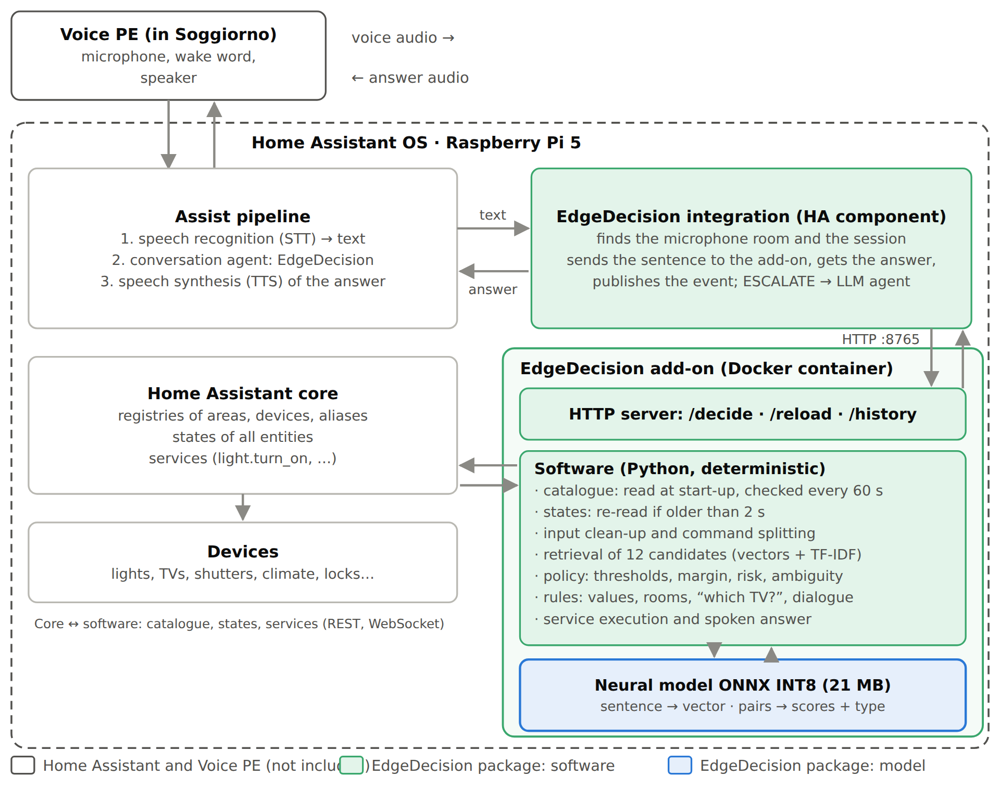

***Figure 4.** System components on a Raspberry Pi 5 with Home Assistant OS. The add-on is a Docker container with an HTTP server on port 8765; the ONNX model runs inside the add-on and is used only by the software. Green: the software of the EdgeDecision package (integration and add-on); blue: the model; white: Home Assistant components, which are not part of the package.*

### 7.1 First example: “accendi luce cucina” (turn on kitchen light)

Figure 5 shows the 18 real steps, from the moment the user speaks to the Voice PE in the living room (Soggiorno) to the spoken answer. The integration sends the add-on a request like this:

    POST /decide {"text": "accendi luce cucina", "context_area": "soggiorno", "session": "<satellite id>", "execute": true, "lang": "it"}

The software re-reads the states if they are older than 2 seconds, checks that the sentence contains known words and notices that “cucina” is the name of a room: the microphone room (Soggiorno) is therefore ignored. Then come the two model passes described in Section 8. The winning capability is “turn on all the lights of the kitchen (Cucina)” with probability 0.9975; the risk is low (threshold 0.85) and the policy decides EXECUTE. The software translates the capability into a service call:

    POST /api/services/light/turn_on {"entity_id": ["light.pendente_tavolo", "light.faretti_isola", "light.striscia_mensola"]}

Home Assistant turns on the three lights; the add-on returns the decision and the answer “Fatto.” (Done.) to the integration, the integration publishes the `edgedecision_decision` event and Assist speaks the answer. The model is involved only in steps 7–8 and 10–11.

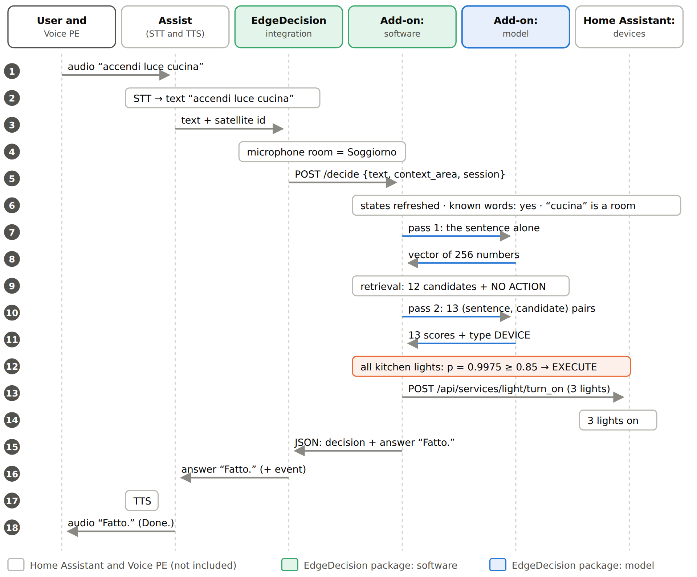

***Figure 5.** Flow of “accendi luce cucina” spoken in the living room. Green columns: EdgeDecision package software; blue column: the model; white columns: Voice PE and Home Assistant. Blue arrows: the two model passes; orange box: the policy decision. Capability, probability, entities and services are those produced by the system on the test home (6-layer model, round 4).*

Figure 6 goes one level down: it splits the add-on into its modules (HTTP server, engine, model, adapter towards Home Assistant) and shows every message with its direction and channel. Table 4 gives the exact content of each message.

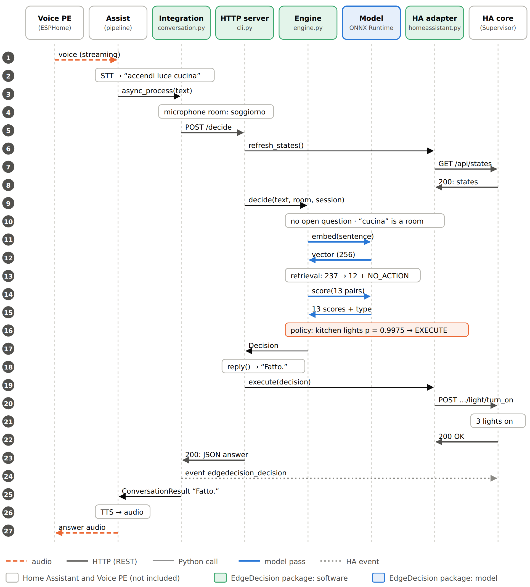

***Figure 6.** “accendi luce cucina”, message by message. Each column is a component (green: EdgeDecision package; blue: model; white: Voice PE and Home Assistant); each arrow is a message, from sender to receiver. Orange dashes: audio; dark grey: HTTP; thin black: calls between Python functions inside the add-on; blue: model passes; dotted: Home Assistant event. Function names are the real ones in the code.*

***Table 4.** The 27 messages of Figure 6: who sends them, to whom, over which channel and with what content (real values of the test home).*

| \#  | From → to            | Channel                                           | Content                                                                                                                         |
|-----|----------------------|---------------------------------------------------|---------------------------------------------------------------------------------------------------------------------------------|
| 1   | Voice PE → Assist    | audio (ESPHome)                                   | the voice, after the wake word                                                                                                  |
| 2   | Assist               | STT (stt.edgestt_nemotron)                        | text “accendi luce cucina”                                                                                                      |
| 3   | Assist → Integration | Python: `async_process()`                         | text, language “it”, satellite id                                                                                               |
| 4   | Integration          | HA registries                                     | satellite area → “soggiorno”                                                                                                    |
| 5   | Integration → Server | HTTP POST `http://local-edgedecision:8765/decide` | `{"text": "accendi luce cucina", "context_area": "soggiorno", "session": "<satellite id>", "execute": true, "lang": "it"}`      |
| 6   | Server → Adapter     | Python: `refresh_states()`                        | only if the states are older than 2 s                                                                                           |
| 7   | Adapter → Core       | HTTP GET `http://supervisor/core/api/states`      | with the Supervisor token                                                                                                       |
| 8   | Core → Adapter       | HTTP 200, JSON                                    | state of every entity (for example light.pendente_tavolo: off)                                                                  |
| 9   | Server → Engine      | Python: `engine.decide()`                         | text, “soggiorno”, session                                                                                                      |
| 10  | Engine               | —                                                 | no pending question for the session; all words known; “cucina” is an area → the microphone room is not used                     |
| 11  | Engine → Model       | ONNX Runtime `session.run`, 1 text                | “accendi luce cucina”                                                                                                           |
| 12  | Model → Engine       | output `embedding`                                | 256 numbers                                                                                                                     |
| 13  | Engine               | numpy                                             | 0.7 × cosine with the 237 capability vectors + 0.3 × TF-IDF → 12 capabilities + NO_ACTION                                       |
| 14  | Engine → Model       | `session.run`, 13 pairs in one batch              | \<s\> sentence \</s\>\</s\> capability text (with state) \</s\>                                                                 |
| 15  | Model → Engine       | outputs `score`, `types`                          | 13 scores + type probabilities (DEVICE)                                                                                         |
| 16  | Engine               | policy and rules                                  | light.turn_on@area:cucina:light, p = 0.9975, low risk (threshold 0.85) → EXECUTE                                                |
| 17  | Engine → Server      | Python: `Decision` object                         | policy, reason “ok”, capability, 3 entities, confidence                                                                         |
| 18  | Server               | `reply()`                                         | answer “Fatto.” (Done.)                                                                                                         |
| 19  | Server → Adapter     | Python: `execute()`                               | the decision                                                                                                                    |
| 20  | Adapter → Core       | HTTP POST `…/api/services/light/turn_on`          | `{"entity_id": ["light.pendente_tavolo", "light.faretti_isola", "light.striscia_mensola"]}`                                     |
| 21  | Core                 | light integrations                                | the 3 lights turn on                                                                                                            |
| 22  | Core → Adapter       | HTTP 200                                          | changed states                                                                                                                  |
| 23  | Server → Integration | HTTP 200, JSON                                    | `{"decision": {"policy": "EXECUTE", ...}, "reply": "Fatto.", "execution": {"executed": true, "service": "light.turn_on", ...}}` |
| 24  | Integration → Core   | event on the HA bus                               | edgedecision_decision: text, room, decision, timings                                                                            |
| 25  | Integration → Assist | Python: `ConversationResult`                      | text to speak “Fatto.”, no open question                                                                                        |
| 26  | Assist               | TTS                                               | audio of “Fatto.”                                                                                                               |
| 27  | Assist → Voice PE    | audio (ESPHome)                                   | the speaker plays the answer                                                                                                    |

### 7.2 Second example: two commands in one sentence

With “accendi luce salotto e spegni la tv della taverna” (turn on the lounge light and turn off the basement TV, Figure 7) the software first evaluates the whole sentence; since it contains two command verbs (accendi, spegni), it splits it at the conjunction “e” (and) and decides each part with its own two passes: six model passes in total, about three times the work of a simple command. “Salotto” is not the name of any room in the test home, but the model associates it with “Salone” (probability 0.9977); the second part chooses the basement TV (0.9999). Both exceed the thresholds, the overall decision is EXECUTE with two parts and the software makes two service calls, `light.turn_on` on Lampada ad arco and Faretti salone and `media_player.turn_off` on the basement TV, then composes a single answer: “Accendo le luci in Salone e spengo TV taverna.” (I turn on the lights in Salone and turn off TV taverna.). If one of the two parts were uncertain, the system would execute the clear one and ask a question only about the other.

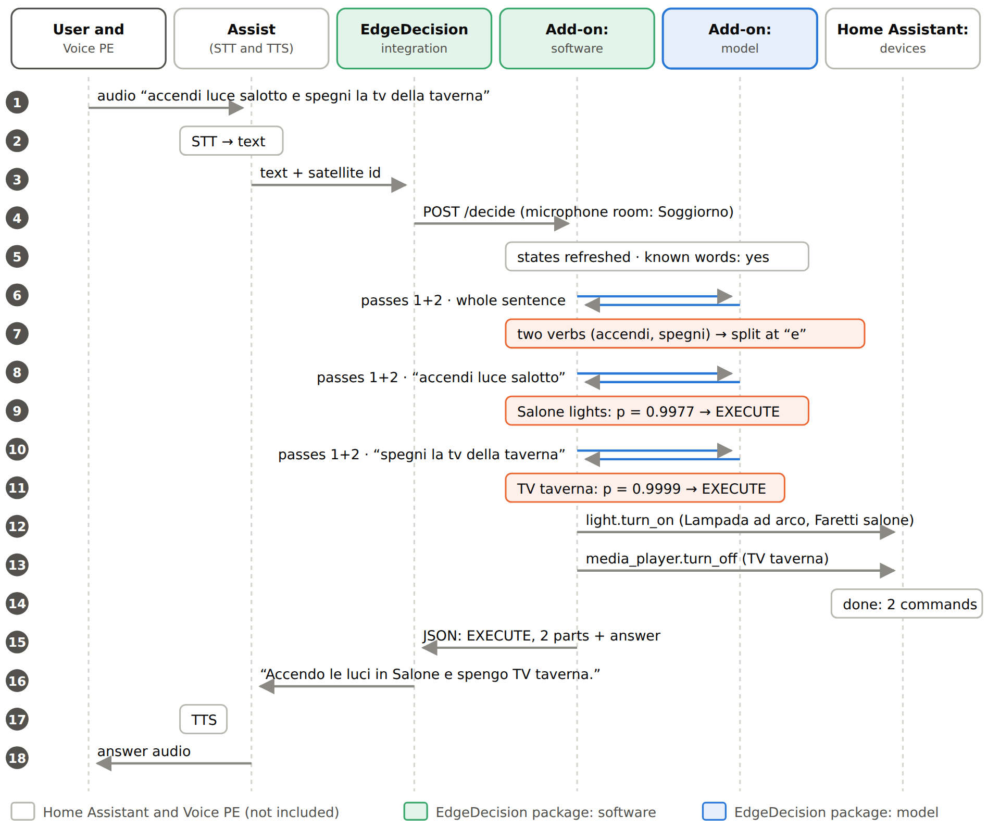

***Figure 7.** Flow of a double command. Each blue double arrow stands for the two model passes (sentence vector and scoring of 13 pairs) on one text: the whole sentence and then each of the two parts.*

Figure 8 shows the same double command inside the add-on, message by message: three pairs of model passes, two policy decisions and two service calls, gathered in a single HTTP response (Table 5).

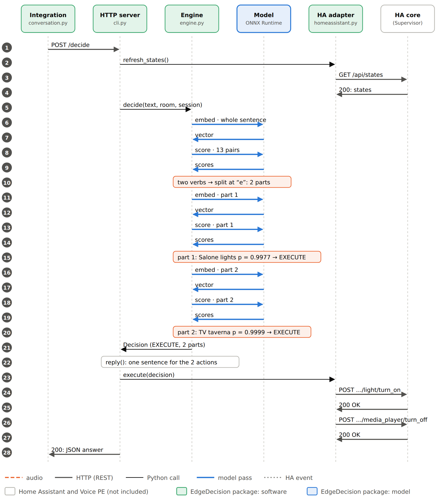

***Figure 8.** The double command inside the add-on. Same legend as Figure 6; the voice part (Voice PE, STT, TTS) is the same as in the first example and is not repeated.*

***Table 5.** Content of the messages of Figure 8 (steps identical to the first example are grouped).*

| \#    | From → to                                | Channel                                        | Content                                                                                                                                                                            |
|-------|------------------------------------------|------------------------------------------------|------------------------------------------------------------------------------------------------------------------------------------------------------------------------------------|
| 1     | Integration → Server                     | HTTP POST /decide                              | `{"text": "accendi luce salotto e spegni la tv della taverna", "context_area": "soggiorno", "session": "<satellite id>", "execute": true, "lang": "it"}`                           |
| 2–5   | Server ↔ Adapter ↔ Core; Server → Engine | as in the first example                        | states refreshed, then `engine.decide()`                                                                                                                                           |
| 6–9   | Engine ↔ Model                           | 2 passes                                       | whole sentence, evaluated first; with two command verbs the system splits it anyway                                                                                                |
| 10    | Engine                                   | splitting                                      | two command verbs (accendi, spegni) → parts “accendi luce salotto” and “spegni la tv della taverna”                                                                                |
| 11–15 | Engine ↔ Model                           | 2 passes + policy                              | part 1 → light.turn_on@area:salone:light, p = 0.9977 → EXECUTE                                                                                                                     |
| 16–20 | Engine ↔ Model                           | 2 passes + policy                              | part 2 → media_player.turn_off@media_player.tv_taverna, p = 0.9999 → EXECUTE                                                                                                       |
| 21    | Engine → Server                          | Python: `Decision`                             | policy EXECUTE, reason “multi_intent”, 2 parts                                                                                                                                     |
| 22    | Server                                   | `reply()`                                      | “Accendo le luci in Salone e spengo TV taverna.”                                                                                                                                   |
| 24    | Adapter → Core                           | HTTP POST …/api/services/light/turn_on         | `{"entity_id": ["light.lampada_arco", "light.faretti_salone"]}`                                                                                                                    |
| 26    | Adapter → Core                           | HTTP POST …/api/services/media_player/turn_off | `{"entity_id": ["media_player.tv_taverna"]}`                                                                                                                                       |
| 28    | Server → Integration                     | HTTP 200, JSON                                 | `{"decision": {"policy": "EXECUTE", "reason": "multi_intent", "parts": [...]}, "reply": "Accendo le luci in Salone e spengo TV taverna.", "execution": {"parts": [{...}, {...}]}}` |

## 8. A worked example: from words to decision

This section follows a real sentence, “accendi la tv” (turn on the tv) said in the basement of the test home (237 capabilities), from text to decision. All numbers are those produced by the 6-layer model of round 4. In the normal case the model runs **twice**: a short pass on the sentence alone, for candidate retrieval, and a pass on the 13 (sentence, candidate) pairs, for the decision.

### 8.1 From words to numbers (pass 1)

The model does not read letters but numbers (Figure 9). The sentence, with the microphone room appended (“accendi la tv \|\| user is in: Taverna”), is split by the SentencePiece tokenizer into 17 pieces: frequent words stay whole (“▁la”, “▁tv”), rare ones are split (“▁ac” + “cendi”); the sign ▁ marks the start of a word, `<s>` and `</s>` the start and end of the text. Each piece has a number in the vocabulary (24,567 entries after pruning) and each number selects one row of the embedding table: 17 vectors of 384 numbers. The 6 encoder layers transform them: in every layer, through attention, each piece combines information from all the others, so that in the end “tv” “knows” it is the object of “accendi” and that it is in the basement. The average of the 17 vectors, projected to 256 dimensions and normalised to length 1, is the *sentence vector*.

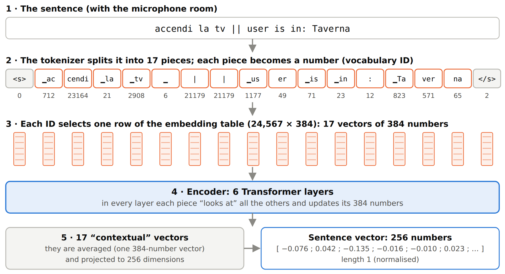

***Figure 9.** Pass 1: from the sentence to the 256-number vector used for retrieval. Pieces and IDs are the real ones of the tokenizer; the first six values of the vector are the real ones produced by the model. The columns of step 3 are schematic (each holds 384 numbers).*

### 8.2 Retrieval of the 12 candidates

Retrieval (Figure 10) compares the sentence with all 237 capabilities in two ways and adds up the results.

- **By meaning.** The text of each capability (for example “media player turn on: … \|\| target: TV taverna … \|\| area: Taverna”, without the state) was turned by the same pass 1 into a 256-number vector *only once*, at start-up and whenever the catalogue changes (about 3 s for 237 capabilities on the test machine). Since all vectors have length 1, a single matrix-vector product gives the 237 cosine similarities: 0.88 for the basement TV, 0.77 for the living-room TV, 0.14 for the living-room shutter.
- **By letters.** Each capability also has a “card” of words: device name and aliases, room name and action keywords in Italian, English and Spanish (for the basement TV: “TV taverna Taverna accendi accendere … turn on switch on … tv televisione …”). The sentence and the cards are broken into character 3- and 4-grams and compared with a TF-IDF index, which gives more weight to rare n-grams. Of the 32 n-grams of “accendi la tv Taverna”, 29 appear in the basement-TV card. This comparison does not use the model and withstands transcription errors: “a cendi” still shares 7 of the 13 n-grams of “accendi” (“cen”, “end”, “ndi”…).

The total score is 0.7 × meaning + 0.3 × letters (the latter divided by its maximum, so it ranges from 0 to 1). The 12 capabilities with the highest total are kept and `NO_ACTION` is always added. The other 225 capabilities are not scored by the model. If the right capability stays outside the 12 the model cannot choose it, but it cannot invent another one either: at most it chooses `NO_ACTION` or asks. This is rare: the right capability is among the 12 for 99.9% of validation sentences and 100% of gold sentences.

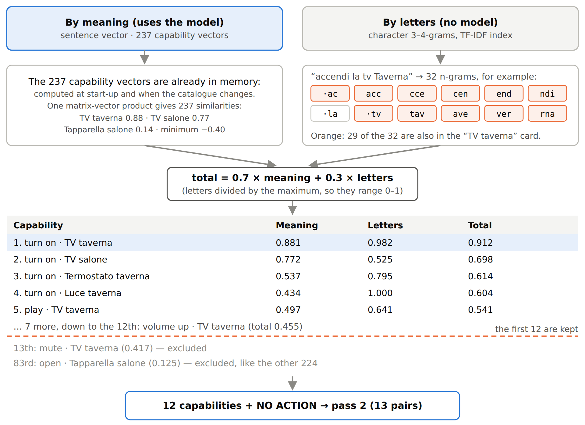

***Figure 10.** Candidate retrieval for “accendi la tv” in the basement, with the real values. Left: comparison by meaning, which uses the vector of Figure 9; right: comparison by letters, which does not use the model. The dot (·) in the n-grams marks the start of a word.*

### 8.3 Scoring and decision (pass 2)

For each of the 13 candidates a pair of texts is formed, `<s> sentence </s></s> capability </s>`, which for the basement TV is 61 pieces long because it also contains the current state (“state: off”). The 13 pairs enter the model together, as a single batch: this is pass 2 of Figure 1. For each pair the score head reads the vector of the first piece, `<s>`, which after the 6 layers summarises the relation between sentence and capability, and produces one number: 10.03 for the basement TV, −0.17 for the living-room TV, −3.45 for `NO_ACTION`. The pair with `NO_ACTION` also provides the request type (here DEVICE). The softmax with temperature 1.31 gives the probabilities (0.9995 for the basement TV), the policy checks thresholds and margin for low risk, and the deterministic rules confirm that the sentence designates a single device of the room: EXECUTE.

### 8.4 How many passes and how much time

Figure 11 shows where the time of one decision goes, measured on a 2-core test machine (median of 25 repetitions: 280 ms in total). Pass 2 takes 96% of the time because it processes 13 long texts; pass 1 works on a single short text (about 3%); retrieval, policy and rules, which do not use the model, weigh less than 1%. On the Raspberry Pi 5 the same decision takes about 150 ms and on the training PC 39 ms; the shares were not measured separately on those devices, but the work done is the same. The number of passes is fixed for each kind of sentence and does not depend on the length of the answer (Table 6).

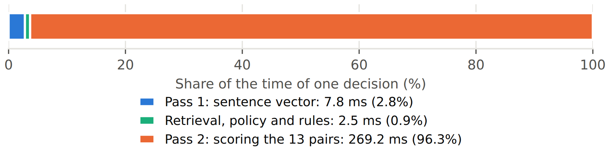

***Figure 11.** Time of one decision for “accendi la tv” in the basement, split between the two model passes and the rest (2-core test machine, median of 25 repetitions).*

***Table 6.** Model passes per sentence, counted by running the system on the test home.*

| Case                                                                  | Example                                                                                                               | Passes on the sentence | 13-pair passes |
|-----------------------------------------------------------------------|-----------------------------------------------------------------------------------------------------------------------|------------------------|----------------|
| Simple command                                                        | “accendi la tv”, in the basement                                                                                      | 1                      | 1              |
| No suitable device in the microphone room: the whole home is searched | “accendi la tv”, in Marco's bedroom (then asks which TV)                                                              | 2                      | 2              |
| Two commands: the whole sentence, then each part                      | “spegni le luci della cucina e accendi la tv della taverna” (turn off the kitchen lights and turn on the basement TV) | 3                      | 3              |
| Round-5 model: word tags                                              | any sentence                                                                                                          | +1                     | —              |
| Once, not per sentence                                                | start-up or changed catalogue: the 237 capability texts                                                               | about 3 s              |                |

## 9. The model

The model is called **e5s-6L**: “e5s” names the model it derives from, `multilingual-e5-small`, and “6L” its 6 layers. The network (Figure 12) is a shared Transformer encoder with four light heads. The score and type heads read the first token (CLS) of a pair of texts; the embedding projection averages the tokens of a single text and produces a normalised 256-dimensional vector; the tag head (from the fifth round) labels every word of the sentence as verb or command (CMD), device or room (OBJ), value (VAL), separator between two commands (SEP) or other (O). All heads live in the same ONNX graph, so retrieval, scoring and command splitting use the same file.

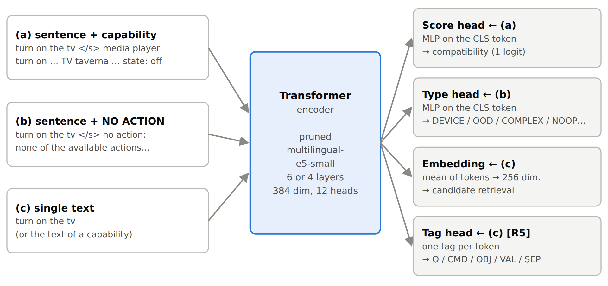

***Figure 12.** The EdgeDecision network: a shared encoder and four heads. (a) and (b) are pairs of texts separated by the `</s>` token; (c) is a single text. The tag head is present from the fifth round (R5).*

## 10. Data

There is no public corpus of home-automation commands labelled against the home catalogue, so all training data is synthetic (Figure 13).

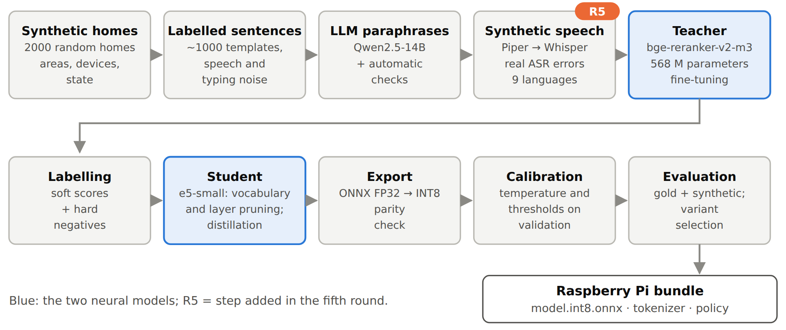

***Figure 13.** The training procedure. Everything runs on a PC with an RTX 3090; only the final bundle is copied to the Raspberry Pi.*

**Synthetic homes.** A generator creates random homes: rooms with names and aliases in several languages, devices drawn with realistic probabilities for each room (lights, shutters and curtains, climate, TVs and speakers, fans, plugs, locks, robot vacuums, alarms, sensors, scenes), with consistent features and states. About 10% of the devices of some kinds get a technical name (“Shelly 2”), which the speaker has to pronounce.

**Labelled sentences.** About 1000 sentence templates produce commands, state questions, ambiguous requests, missing or out-of-range values, negations, out-of-domain requests, complex requests and absent devices, each with its expected decision. A noise generator simulates typical speech-recognition and typing errors. About a quarter of the synthetic test sentences use templates never seen in training.

**LLM paraphrases.** A local LLM (Qwen2.5-14B-Instruct, via Ollama) rewrites seed sentences more naturally. Each paraphrase must pass automatic checks: the same numeric values extracted by the runtime parser, the same room (neither lost nor invented), and a multiple-choice judgement by the same LLM between the correct capability and similar ones. In the first round, about 4000 seeds produced 31,753 paraphrases, of which 21,602 (68%) were accepted.

**Gold set.** 227 hand-written sentences in Italian (106), English (59) and Spanish (62) on a demo home, never used for training or for choosing hyperparameters, measure behaviour on realistic phrasing.

***Table 7.** Data sizes. Rounds 1–4: 3 languages (IT, EN, ES). Round 5: 9 languages; the homes of the earlier rounds are reused and 350 homes are added for each new language.*

|                                             | Rounds 1–4        | Round 5           |
|---------------------------------------------|-------------------|-------------------|
| Training / validation / test homes          | 2,000 / 150 / 150 | 4,100 / 300 / 300 |
| Template sentences (training)               | 100,000           | 205,000           |
| LLM paraphrases and LLM-generated sentences | 24,308            | 50,648            |
| Synthetic-speech transcriptions             | —                 | 9,556             |
| Total labelled training examples            | 124,308           | 265,204           |
| Synthetic test (unseen homes)               | 7,500             | 15,000            |
| Hand-written gold set                       | 227               | 227               |

## 11. How we obtained the e5s-6L model

This section describes how two generic pre-trained models become a 24.3 MB model that runs on a Raspberry Pi. The Raspberry Pi model is not trained from scratch: it is `multilingual-e5-small` transformed in five steps (Figure 14). The first two make it smaller, the third gives it the outputs needed to decide, the fourth teaches it the task by imitating a much larger model, the fifth compresses it and calibrates its probabilities. Figure 15 shows the size of the model after each step; Table 8 summarises the starting models.

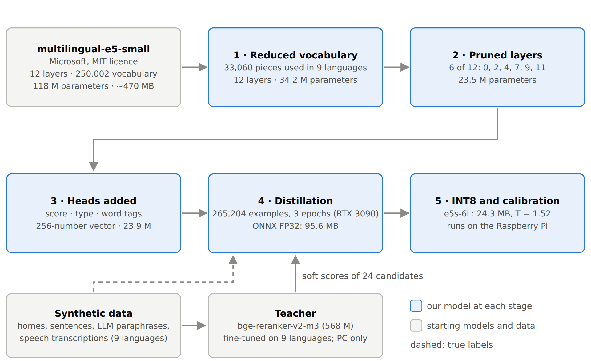

***Figure 14.** From `multilingual-e5-small` to e5s-6L (round 5). Blue: our model at each stage; grey: starting models and data. The teacher and the synthetic data are used only during training, on the PC; only the result of step 5 reaches the Raspberry Pi. The student learns from the teacher's scores (solid arrow) and from the true labels of the data (dashed).*

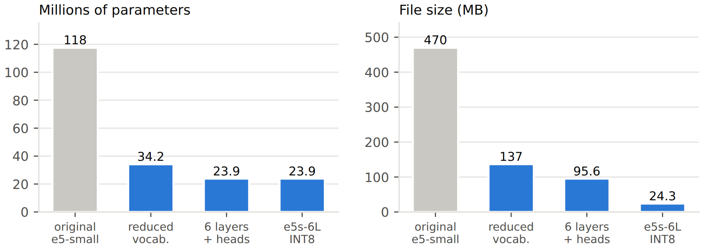

***Figure 15.** Parameters and file size after each step. Vocabulary reduction alone removes 71% of the parameters; layer pruning removes another third; INT8 quantization does not change the number of parameters but divides the file by almost 4. FP32 sizes are those of the real files, except the 12-layer model with reduced vocabulary, estimated at 4 bytes per parameter.*

***Table 8.** The starting models.*

|                  | Teacher                                 | Student                                |
|------------------|-----------------------------------------|----------------------------------------|
| Model            | `BAAI/bge-reranker-v2-m3`               | `intfloat/multilingual-e5-small`       |
| Original purpose | re-ranking cross-encoder                | sentence-embedding encoder             |
| Architecture     | XLM-RoBERTa large: 24 layers, 1024 dim. | 12 layers, 384 dim., 12 heads          |
| Parameters       | 568 M                                   | 118 M (96 M of them in the vocabulary) |
| Vocabulary       | 250,002 pieces                          | 250,002 pieces                         |
| Role             | only during training, on the PC         | becomes the Raspberry Pi model         |

### 11.1 Preparation: teacher training

The teacher was fine-tuned for one epoch on the EdgeDecision task (listwise score plus request type), on 90,000 examples, with groups of 16 candidates, bf16 and gradient checkpointing to fit in the 24 GB of the GPU. On validation it ranks the correct answer first in 98.9% of cases and recognises the request type in 100%. Rounds 2–4 reused the same teacher; round 5 retrained it on 130,000 examples in 9 languages (98.5% and 99.5%).

### 11.2 Preparation: labelling

For every training example the teacher scores the sentence against NO ACTION, the correct capabilities and 32 other capabilities that are similar in text or structure, and keeps the scores of 24 candidates. These *soft scores* tell the student not only which answer is right but also which alternatives are almost right, and high-scoring wrong candidates become *hard negatives*. In the first round the teacher agrees with the true label on 97.4% of the training examples; on the others the student learns from the true label only.

### 11.3 Step 1: vocabulary reduction

In `multilingual-e5-small` the embedding table (250,002 pieces × 384 dimensions) holds 96 of the 118 million parameters, because it serves about 100 languages. We keep only: the pieces that occur in the training corpus, the 20,000 most probable Latin-script pieces, to cover new words such as device names, the single characters and the special tokens. With the three languages of rounds 1–4 the vocabulary dropped to 24,567 pieces; with the nine languages of round 5 it rises to 33,060. The 12-layer model thus goes from 118 to 34.2 million parameters (34.5 with the heads of step 3, Figure 16). Tokenisation does not change: in the round-1 check, the sequences produced by the old and the new vocabulary are identical on all 3,006 sentences.

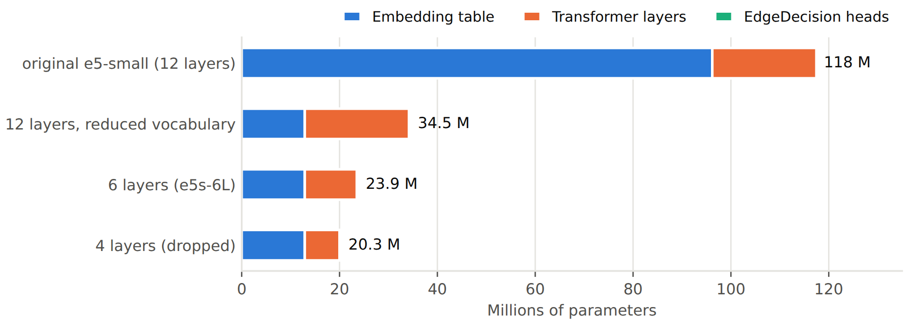

***Figure 16.** Parameters by component, with the round-5 vocabulary (the EdgeDecision heads, 0.32 M, are too small to be visible). Vocabulary reduction alone divides the model by 3.4; layer pruning reduces only the Transformer part. The 4-layer variant was trained up to round 5 and then dropped.*

### 11.4 Step 2: layer pruning

From the 12-layer encoder we keep *k* evenly spaced layers, always including the first and the last (Figure 17). The first layer reads the tokens and the last produces the representations the heads expect; the intermediate ones are partly redundant. With 6 layers out of 12 the model drops from 34.2 to 23.5 million parameters. The pruned model loses accuracy, which it recovers during the training of step 4.

### 11.5 Step 3: decision heads

On top of the encoder we add the four heads of Figure 12: the score of a sentence–capability pair, the request type (6 classes), the tag of each word (5 classes) and the projection to a 256-number vector for retrieval. Together they hold 0.32 million parameters, less than 2% of the model, which thus reaches 23.9 million. The heads start from random weights: everything they know comes from step 4.

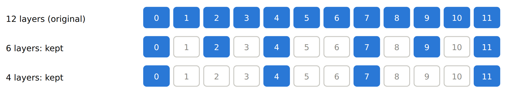

***Figure 17.** Layers of the original encoder kept in the 6-layer (0, 2, 4, 7, 9, 11) and 4-layer (0, 4, 7, 11) variants.*

### 11.6 Step 4: training by distillation

Each variant (12, 6 or 4 layers) is trained on the labelled examples with the combined loss (ranking, request type, distillation, retrieval and tags): 3 epochs (4 in round 1 and for the 4-layer variant), batches of 16 groups of 16 candidates, learning rate 6·10−5 for the encoder and 5·10−4 for the heads, bf16. In round 1 the 12-layer variant ranks the correct answer first on 99.27% of validation examples and the 6-layer one on 99.03%: halving the layers costs only 0.24 points. In round 5 the 6-layer student was trained on 265,204 examples in nine languages, for 3 epochs.

### 11.7 Step 5a: export and quantization

The model is exported to ONNX (FP32), optimised and quantized to INT8 with dynamic weight quantization. A parity check compares the scores with PyTorch: in FP32 the maximum difference stays below 10−5; in INT8 the correlation with the original scores remains 0.9995 for the round-4 6-layer model and 0.9990 for the round-5 one. In round 5 the 6-layer file shrinks from 95.6 to 24.3 MB.

### 11.8 Step 5b: calibration and variant selection

On 4,000 validation examples, using the INT8 model and the real retriever, we fit the temperature and then the thresholds of Table 2, searching for the combination that maximises accuracy with an execution precision of at least 99%. Finally the variant is selected: among those with p95 latency at most 120 ms on the PC (4 threads) and gold execution precision of at least 98%, the one with the highest gold accuracy wins. In round 5 the fitted temperature is 1.52; the 99% precision target on validation was not reached (98.5%) and the round-4 thresholds were kept. From round 5 on only the 6-layer variant is trained (see “Why only 6 layers”).

***Table 9.** The student variants (round 5; for the 12-layer variant, round 2 with the vocabulary of the time). Latencies on the training PC (CPU, 4 threads) on the gold sentences, retrieval included.*

| Variant           | Layers | Parameters | ONNX FP32 | ONNX INT8 | Latency p50 / p95 |
|-------------------|--------|------------|-----------|-----------|-------------------|
| e5s-12L (round 2) | 12     | 31.2 M     | 125.2 MB  | 32.0 MB   | 80.8 / 131.3 ms   |
| e5s-6L            | 6      | 23.9 M     | 95.6 MB   | 24.3 MB   | 41.4 / 66.6 ms    |
| e5s-4L (dropped)  | 4      | 20.3 M     | 81.4 MB   | 20.6 MB   | 29.3 / 47.8 ms    |

## 12. Results

The main metrics are **decision accuracy** (the decision and, for EXECUTE, the capability match the expected ones) and **execution precision** (the fraction of EXECUTE decisions that perform the right action): the latter measures risk, because a wrong execution actually changes something in the home.

### 12.1 Accuracy–latency trade-off

Round 2 is the only round in which all three variants were trained (Figure 18). The 12-layer variant is the most accurate (97.8% on gold) but its p95 latency, 131 ms on the PC, exceeds the limit; the 6-layer variant loses 0.9 points and halves the latency; the 4-layer variant is the fastest but loses another 1.3 points. From round 3 on the 12-layer variant was no longer trained.

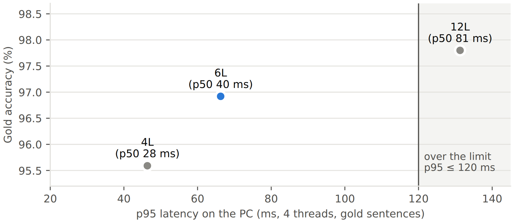

***Figure 18.** Accuracy on the 227 gold sentences versus p95 latency on the PC, round 2. The grey area exceeds the 120 ms limit; median latency in brackets.*

### 12.2 Improvement across rounds

Each round started from the error analysis of the previous one and changed the data, not the model. Round 2: corrected labels and extra examples where round 1 failed. Round 3: devices whose name contains the generic noun (“Ventilatore a soffitto”, ceiling fan) and media-content requests. Round 4: devices called by name, microphone in a room other than the one of the command, the option of including one's own real home. On gold the 6-layer variant goes from 96.5% to 97.8% and wrong executions from 3 to 0 (Figure 19, Table 10). Round 5 adds six languages: on gold, which is only in Italian, English and Spanish, the 6-layer variant drops to 96.9%, still with no wrong execution, and returns to 97.8% with the software fixes described below. Accuracy on the synthetic test instead drops slightly across rounds because the test is regenerated every round and includes the newly introduced hard cases: it is not comparable across rounds, while gold is.

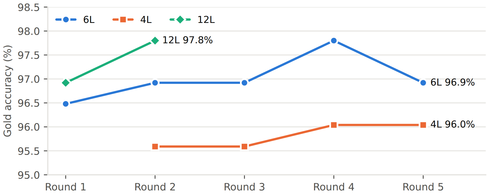

***Figure 19.** Gold accuracy in the five rounds. The 4-layer variant was introduced in round 2 and dropped after round 5; the 12-layer variant was not trained after round 2. The round-5 dip is the price of the six new languages, measured with the software of the time.*

***Table 10.** Results by round and variant. Gold: 227 hand-written sentences; synthetic: 7,500 sentences on 150 unseen homes in rounds 1–4, 15,000 on 300 homes in 9 languages in round 5 (regenerated every round). Prec. = execution precision; err. = wrong executions. Highlighted: the variant in use on the Raspberry Pi.*

| Round | Variant | Gold acc. | Gold prec. | Gold err. | Synth. acc. | Synth. prec. |
|-------|---------|-----------|------------|-----------|-------------|--------------|
| 1     | 12L     | 96.9%     | 99.4%      | 1         | 95.5%       | 97.2%        |
| 1     | 6L      | 96.5%     | 98.1%      | 3         | 94.8%       | 96.9%        |
| 2     | 12L     | 97.8%     | 98.7%      | 2         | 95.7%       | 98.2%        |
| 2     | 6L      | 96.9%     | 99.3%      | 1         | 93.8%       | 97.3%        |
| 2     | 4L      | 95.6%     | 98.7%      | 2         | 93.6%       | 97.5%        |
| 3     | 6L      | 96.9%     | 100%       | 0         | 93.7%       | 97.5%        |
| 3     | 4L      | 95.6%     | 100%       | 0         | 92.7%       | 97.8%        |
| 4     | 6L      | 97.8%     | 100%       | 0         | 92.8%       | 97.6%        |
| 4     | 4L      | 96.0%     | 100%       | 0         | 91.0%       | 97.1%        |
| 5     | 6L      | 96.9%     | 100%       | 0         | 92.9%       | 97.5%        |
| 5     | 4L      | 96.0%     | 99.3%      | 1         | 92.5%       | 96.8%        |

Table 11 shows the decisions of the variant in use. The 5 gold errors are all cautious: executable commands that lead to a question instead of an execution (“alza la luminosità del lampadario”, “turn on the floor lamp”, “activa el riego”…); no wrong action is executed. By language, accuracy is 98.1% in Italian, 98.3% in English and 96.8% in Spanish.

***Table 11.** Confusion matrix on the 227 gold sentences (6 layers, round 4). Rows: expected decision; columns: decision taken.*

| Expected \\ taken | EXECUTE | CLARIFY | REJECT | ESCALATE |
|-------------------|---------|---------|--------|----------|
| EXECUTE           | **146** | 5       | 0      | 0        |
| CLARIFY           | 0       | **20**  | 0      | 0        |
| REJECT            | 0       | 0       | **23** | 0        |
| ESCALATE          | 5       | 0       | 0      | **28**   |

The 5 sentences of the ESCALATE row decided as EXECUTE are not errors: they are multiple commands (“turn on X and close Y”) that the gold set labels as ESCALATE, but for which the evaluation also accepts executing each part separately, as long as each one is on the right device, as in these 5 cases. This is why accuracy is 222/227 = 97.8% rather than the sum of the diagonal. On validation, however, calibration did not reach the 99% precision target: with the selected thresholds precision is 98.5% and 91.4% of executable commands are executed.

### 12.3 Field test: Raspberry Pi 5 and Home Assistant

For a test independent of the training data we built a test home in Home Assistant with 51 virtual devices (lights, shutters, thermostats, two TVs, locks, a robot vacuum, an alarm, sensors, scenes), with names never used by the generator. EdgeDecision, 6-layer variant of round 4, runs as an add-on on a Raspberry Pi 5 with Home Assistant OS. Results are in Table 12.

***Table 12.** Test on the Raspberry Pi 5 (6 layers, round 4).*

| Test                                                                        | Result          |
|-----------------------------------------------------------------------------|-----------------|
| Correct decisions on 170 sentences (130 IT, 21 EN, 19 ES; nothing executed) | 94.1% (160/170) |
| Wrong executions / execution precision                                      | 1 / 99.2%       |
| Scenarios executed on the virtual devices, with dialogues and confirmations | 20 / 20         |
| Tests through Assist (conversation agent)                                   | 5 / 5           |
| Decision time on the Pi, median                                             | ≈ 150 ms        |

The single wrong execution is instructive: “chiudi il lucernario della mansarda” (close the attic skylight) turned off the attic light. “Lucernario” does not appear in any device name and resembles “luce” (light); the model picked the device of the right room with the closest action. The other errors are cautious: questions instead of executions, or rejections for devices the model did not recognise (“tenda da sole”, awning; “skylight”).

## 13. The fifth round: nine languages

Rounds 1–4 covered Italian, English and Spanish. The fifth round adds French, German, Dutch, Portuguese, Polish and Swedish, chosen for the spread of Home Assistant in Europe, and has a second goal: moving into the model rules that so far depended on word lists in Italian, English and Spanish. For this reason it introduces the word-tag head (to split multiple commands and find values in any language) and the CONFIRM and HISTORY types. For the new languages a generic rule replaces the one based on generic nouns: if the sentence contains no word that distinguishes the chosen device from the others of the same kind and the model gives an alternative at least 15% of the probability of the chosen device, the system asks.

**Starting point.** We translated the test home into the six new languages (39 sentences per language) and evaluated the round-4 model, which has never seen them (grey bars of Figure 21). Performance collapses, from 94.5% in Italian to between 23% and 51%, and above all many wrong executions appear: 32 in the six new languages, 11 of them in Polish.

**Data.** The generator produces 350 new homes for each language; the LLM generates about 20,900 verified paraphrases and about 5,100 out-of-domain, complex or no-action sentences in the new languages. To teach the model real speech-recognition errors, up to 1,500 sentences per language (about 11,300 in all) are read by a synthetic voice (Piper) and transcribed by Whisper *small*: the transcription replaces the sentence, with the same labels. Whisper sometimes does not transcribe but invents a different sentence (for example “bitte ändere die Lautstärke” → “wenn es nicht so ist dann ist es so”). Transcriptions with a character similarity below 0.7 to the original are discarded: 31% in German, 20% in Portuguese and between 1.6% and 3.4% in the other languages, leaving 9,556. Figure 20 shows the final composition.

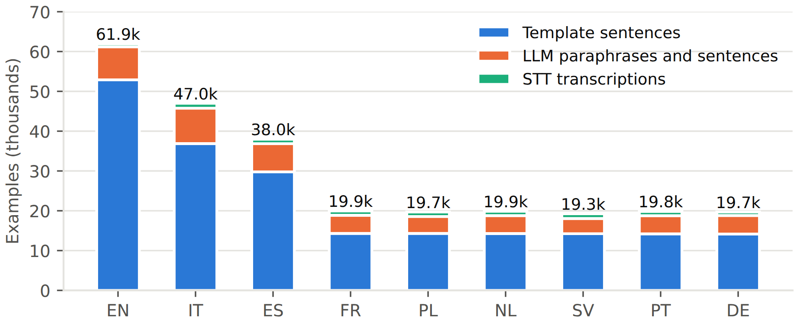

***Figure 20.** Round-5 training examples by language and source; the synthetic-speech transcriptions (about 1,000 per language) are the thin top layer. English, Italian and Spanish have more examples because they include the homes and paraphrases of the earlier rounds.*

### 13.1 Model results and why only 6 layers

The teacher retrained in 9 languages ranks the correct answer first in 98.5% of validation cases and recognises the request type in 99.5%. The 6- and 4-layer students were trained on the same data (Table 13). The 4-layer variant is a third faster, but on the translated test homes it executes almost twice as many commands by mistake (11 against 6) and it is worse on every test set. Since a wrong execution really changes something in the home, from round 5 on we keep only the 6-layer variant: the 4-layer one is no longer trained or shipped, and the Home Assistant package contains a single model.

***Table 13.** The two round-5 variants, with the runtime software of the time. Test homes: 362 sentences in the 7 translated versions. Latencies on the PC (CPU, 4 threads).*

|                                                         | e5s-6L         | e5s-4L         |
|---------------------------------------------------------|----------------|----------------|
| Gold: accuracy / execution precision                    | 96.9% / 100%   | 96.0% / 99.3%  |
| Synthetic test (15,000 sentences): accuracy / precision | 92.9% / 97.5%  | 92.5% / 96.8%  |
| Test homes in 7 languages: correct / wrong executions   | 89.2% / 6      | 88.1% / 11     |
| Latency p50 / p95                                       | 41.4 / 66.6 ms | 29.3 / 47.8 ms |
| INT8 file                                               | 24.3 MB        | 20.6 MB        |

### 13.2 Software fixes after round 5

Almost all the errors left on the test homes came from the software around the model, not from the model, and were fixed without retraining (add-on versions 0.6.0–0.6.3):

- **Colours and values.** Homes saved before round 5 knew colour names in three languages only; the words of the other languages are now added when a home is loaded. The Polish letter “ł” (and “ß”, “ø”) was split into two words, so “do połowy” (halfway) was not recognised.
- **Double commands.** The tag head rarely marks the conjunction as a separator; sentences are now split at the conjunctions of the nine languages, and ambiguous words (“i”, an Italian article and a Polish conjunction; “en”, a Spanish preposition and a Dutch conjunction) count as separators only in the language of the sentence and only when a verb follows.
- **Names and rooms.** If the sentence says the full name of a device, or it is a generic sentence (“turn on the light”) said in a room with a single suitable device, the choice is certain even when the probability is just below the threshold; if the sentence contains a word that distinguishes another device and none of the chosen one, the system asks instead of executing; if the sentence is exactly the name of a scene, the scene is activated.
- **Conditions.** The rules that hand conditional requests (“if it rains…”, “wenn es regnet…”) to the LLM now exist in all nine languages.

**Language as a parameter.** The Assist integration knows the language of the sentence. We checked whether it paid to use it also to calibrate the model per language: the temperature fitted on the Italian validation sentences alone is 1.60, identical to the global one, and lower execution thresholds for some languages recover 8 of 1,500 synthetic sentences at the cost of 3 more wrong executions. Both ideas were discarded; the language is used only to read ambiguous conjunctions.

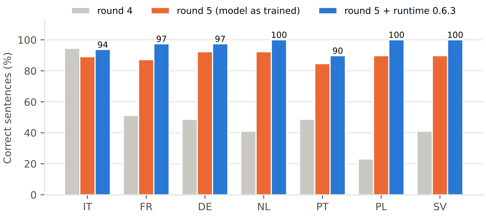

***Figure 21.** Correct sentences on the test homes in each language: round-4 model, round-5 model with the software of the time and with software 0.6.3. IT: 128 sentences; other languages: 39 each. Wrong executions in total: 33, 6 and 2. The fixes were designed by looking at the errors on these same sentences, so the last series is optimistic; the independent check is gold (222/227, no wrong execution).*

### 13.3 Test in every language on Raspberry Pi and Mac

The round-5 model with software 0.6.3 was tested on the test homes in all nine languages, both on the Raspberry Pi 5 inside Home Assistant and on a Mac with an Apple processor, with the same 404 sentences (Table 14). The two results almost coincide: the small differences come from the INT8 arithmetic, which differs between the two processors and slightly moves the scores close to the thresholds. The two wrong executions left are low-risk model errors: “chiudi il lucernario della mansarda” (close the attic skylight) turns off the attic light, and “liga a máquina de lavar loiça” (the dishwasher, absent) turns on the washing machine. All other errors are questions or refusals.

***Table 14.** Correct sentences by language, round-5 model with software 0.6.3. The Italian home also holds the English and Spanish sentences. Median time: on the Mac the decision only, on the Pi also the network round trip from the Mac.*

| Language         | Sentences | Mac (Apple, arm64) | Raspberry Pi 5 |
|------------------|-----------|--------------------|----------------|
| Italian          | 130       | 127                | 125            |
| English          | 21        | 17                 | 17             |
| Spanish          | 19        | 15                 | 16             |
| French           | 39        | 38                 | 38             |
| German           | 39        | 38                 | 38             |
| Dutch            | 39        | 39                 | 39             |
| Portuguese       | 39        | 35                 | 35             |
| Polish           | 39        | 39                 | 38             |
| Swedish          | 39        | 39                 | 39             |
| **Total**        | 404       | 387 (95.8%)        | 385 (95.3%)    |
| Wrong executions |           | 2                  | 2              |
| Median time      |           | 36 ms              | 174 ms         |

On the Home Assistant test home (170 sentences in Italian, English and Spanish) round 5 with software 0.6.0 scored 150/170 (88.2%), against 160/170 for round 4, with 20 of 20 scenarios executed correctly on the virtual devices and 5 of 5 tests through Assist; with fixes 0.6.1–0.6.3 the same sentences rise to 158/170 on the Pi. The price of the six new languages is therefore about one point in Italian, English and Spanish.

## 14. The sixth round: weather and music by name

The sixth round adds three things people ask a voice assistant every day. The first is the **weather**: current conditions and the forecast for one day, read from the Home Assistant weather entity and reported in the language of the question. The second is **music by name**: sentences such as “play radio deejay in the kitchen”, “play bohemian rhapsody” or “put on my relax playlist” on Music Assistant players, which search Spotify, Radio Browser, TuneIn or local files for songs, artists, playlists and stations by name. The model learns to tag the content words (“radio deejay”) as VALUE, and they are passed unchanged to the search: EdgeDecision only chooses the player. The third concerns **timers and alarms**, which the model learns to recognise and hand to the Home Assistant agent. The round also adds targeted data for the cases that remained weak in round 5. To measure the new functions we wrote an “r6” test set of 105 sentences in the nine languages: 15 in Italian, 14 in each of the six new languages, 4 in English and 2 in Spanish.

**Acceptance gates.** From the sixth round on, a new model replaces the one in use only if it passes automatic checks, on the same test sets and with the same software:

- **Gold:** no additional wrong executions and at most one accuracy point lost.
- **Test homes:** at most one fewer correct sentence in each language and no more wrong executions in total.
- **r6:** at least 85% correct and no wrong execution.
- **Latency:** median latency at most 15% higher.

***Table 15.** Rounds 5 and 6 on the same test sets, measured on the PC. Test homes: 404 sentences in 9 languages; r6: 105 sentences in 9 languages.*

|                              | Round 5 + 0.6.3 | Round 6 + 0.6.3 | Round 6 + 0.7.0 | Round 6 + 0.7.1 |
|------------------------------|-----------------|-----------------|-----------------|-----------------|
| Gold (227): correct          | 222             | 218             | 221             | 220             |
| Test homes: correct          | 386             | 387             | 393             | 393             |
| Test homes: wrong executions | 2               | 2               | 1               | 1               |
| r6: correct                  | 11              | 80              | 103             | 103             |
| r6: wrong executions         | 9               | 0               | 0               | 0               |
| Gates passed                 | –               | no (3 failed)   | yes             | yes             |

**Model results.** The round-5 model got almost every r6 sentence wrong and executed 9 of them wrongly. The round-6 model, as it comes out of training, never executes the wrong action and solves 80 of 105. It fails three gates, however: gold drops to 218, German loses two sentences and r6 stays below 85% (Table 15). Median latency does not change (37 → 38 ms on the PC).

**Software fixes (0.7.0).** The r6 errors almost all had the same cause. The model recognised the content, but the request-type head classified sentences such as “metti un po' di jazz” or “lance ma playlist détente” as COMPLEX, and a rule handed them to the LLM. In other cases a radio station with an unknown name (“rmf fm”, “mix megapol”) was rejected as unsupported. Without retraining, we changed the software around the model:

- **Content first.** If the tag head finds content words and the home has a player that searches by name, the sentence becomes playback of that content, unless the model judges it clearly out of domain.
- **Music in a room.** “Play music in the kitchen” on a Music Assistant player starts music instead of just switching the player on.
- **Weather, timers and alarms** are exempt from the rules that hand complex requests to the LLM.
- **Another room.** If content is requested for a room without players, the system asks instead of using a player in another room.

With software 0.7.0 all gates pass: 221 of 227 on gold, 393 of 404 on the test homes with a single wrong execution, 103 of 105 on r6. On the Raspberry Pi 5 inside Home Assistant the same tests give 394 of 404 and 103 of 105, with a median latency of 147 ms; on the Mac, 394 of 404 in 36 ms. As in round 5, the fixes were designed by looking at the errors on these sentences, so the test-home and r6 figures are optimistic; the independent check remains gold. The remaining errors are almost all questions or rejections: “open the skylight” and “cierra la claraboya” still do not find the roof window, which only has an Italian name, and “apri il cancello” asks instead of rejecting. The only wrong execution is still “liga a máquina de lavar loiça”: there is no dishwasher and the system turns on the washing machine.

### 14.1 State questions (0.7.1)

The model can read the state of a single device (“is the kitchen window open?”). Version 0.7.1 extends questions without retraining, through software rules applied after the model's decision:

- **Room.** “Is the living-room light on?” in a room with several lights answers with the state of all of them.
- **Whole house.** “Are any lights on?”, “which windows are open?”, “how many lights are on?” produce the list or the count across lights, plugs, blinds, doors and windows, locks, TVs and speakers, and fans.
- **Room only.** “Turn on in the kitchen”, without saying what, turns on the room's lights.

The answers are composed by the software in the nine languages, with correct gender and number (“the window is open”, “the windows are open”). On the same sets 0.7.1 scores 220/227 on gold, 393/404 on the test homes and 103/105 on r6, without degrading what already worked.

## 15. The seventh round: the whole house, second homes, timers

The seventh round widens the domain to every kind of dwelling: flats, houses on several floors, holiday homes by the sea or in the mountains, hotels. It added:

- **The whole house and floors:** “turn everything off”, “turn off the lights on the first floor”, “what is still on?”, “who is home?”. “Turn everything off” acts only on lights, players, fans and unprotected switches: it never touches locks, alarms, valves, fridges or boilers.
- **Devices of second homes:** water and gas valves, water heaters, climate presets (eco, comfort, away), humidifiers, leak, smoke, motion and power sensors, gate buttons, venetian-blind slats, robot lawn mowers.
- **TV and automations:** input selection (“put Netflix on the TV”), shuffle, scripts and automations, people's presence.
- **Timers, alarms, announcements and shopping list, handled directly.** Instead of passing them to another agent, EdgeDecision recognises them and reads durations and times in the nine languages, including forms such as “un quarto alle otto”, “halb acht” or “wpół do ósmej”. It then calls Home Assistant's native intents on the satellite that heard the sentence, so the timer rings on the right Voice PE.
- **Polite forms and hotel requests.** “Could you turn on the light?” is executed as a command; “can I have clean towels?” goes to the other agent instead of getting an “I can't”. The round also adds regional variants and fixes cases that were still weak.

Two virtual entities stand for functions that do not belong to a device: “Voice assistant” (timers, alarms, announcements) and “Whole house” (turn everything off, state of the house); a third, “other agent”, collects what the home cannot do by itself (weather without a weather entity, music without Music Assistant). They remain capabilities like any other, chosen by the same model.

**From software to model.** Round 7 teaches the model the choices that rules made in versions 0.7.x: room or whole house in state questions, TV state, commands with only a room, recognition of content. The deterministic parts stay in the software, where a rule is more reliable than a model: the text of the replies, reading numbers, durations and times, the safety exclusions and the intent calls.

**Data and test.** The new sentences come from templates written by hand in each of the nine languages, not from the LLM; the paraphrases of earlier rounds are reused, except those whose label changes. The new test set “r7” has 215 sentences in the nine languages. The round-6 model solves 82 of them and executes 16 wrongly: the new functions cannot be added by software alone. The round-6 gates are joined by gates on r7: at least 85% correct, at least 75% in every language and no wrong execution.

### 15.1 Three trainings: 7, 7b and 7c

**Round 7.** The first training learned most of the new functions (192 of 215 r7 sentences) but failed ten gates: gold fell from 220 to 206 sentences, five languages of the test homes lost more than one sentence, r6 fell from 103 to 84, and wrong executions appeared (7 on r7). The analysis found a cause in the data: the training homes lacked the virtual entities that the software adds in Home Assistant, so at runtime the model saw candidates it had never met, and a request for weather or music in a home without a weather entity or Music Assistant was labelled as a rejection.

**Round 7b.** The second training (14 hours on the RTX 3090) gives every synthetic home the same virtual entities as Home Assistant and treats requests the home cannot fulfil by itself as requests to pass to the other agent. On r7 it solves 207 of 215 sentences with no wrong execution, but on gold it stays below round 6 (212 sentences against 218 with the same software, and one wrong execution) and asks “which one?” more often on basic commands. Add-on version 0.8.0 therefore shipped it as an optional model next to the round-6 one.

**Round 7c.** The third training (14.4 hours) starts from the errors of 7b and from the first real sessions on the author's Raspberry Pi, with EdgeSTT. It removes two label conflicts: music requests such as “play some jazz” were also in the list of complex requests, and Spanish “vale” was both “yes” and “cancel”. It then adds the sentences actually heard and their variants: “what time is the alarm?” in many forms, including as the speech recogniser writes them (“a che orai la sveglia”); times said digit by digit (“alle tredici zero cinque”); the history asked without a verb (“ultimi comandi eseguiti”); long sentences heard from a TV or a radio, which must stay out of domain; scenes named in another language; players with a musical name (“Musica”); more examples for Spanish and English homes, the weakest in the 7b tests. A new test set “r7c” of 48 sentences measures these cases.

**Thresholds.** The calibration of 7c chose higher ambiguity and request-type thresholds than 7b (ambiguity ratio 0.45 instead of 0.30; thresholds for complex and no-action requests 0.5 and 0.8 instead of 0.6 and 0.6). With the same model and software, the 7b thresholds raise gold from 211 to 214 sentences, while the other sets stay the same or lose one sentence. Version 1.0 uses the 7c model with the 7b thresholds and the temperature estimated for 7c (1.45).

***Table 16.** Correct sentences on the test sets, measured on the PC. Round 6 with the software in use on 2 October (0.7.x); rounds 7b and 7c with software 0.8.4, the software of version 1.0. Round 7c uses the 7b thresholds.*

| Set                                     | Round 6 | Round 7b | Round 7c (1.0) |
|-----------------------------------------|---------|----------|----------------|
| Gold (227 sentences, IT/EN/ES)          | 220     | 212      | 214            |
| Test homes (404 sentences, 9 languages) | 392     | 387      | 385            |
| r6 (105 sentences)                      | 103     | 95       | 99             |
| r7 (215 sentences)                      | 82      | 207      | 206            |
| r7c (48 sentences)                      | –       | 35       | 46             |
| Wrong executions, all sets              | 17      | 2        | 0              |
| Median latency on the PC                | 38 ms   | 40 ms    | 39 ms          |

With software 0.8.4, 7c passes every gate but one: Spanish on the test homes drops from 15 to 13 of 19 sentences (the other languages: Italian 125/130, English 17/21, French, German and Dutch 39/39, Portuguese 37/39, Polish and Swedish 38/39). The Spanish errors are all cautious: questions or rejections, almost all about devices that only have an Italian name (“claraboya” for the skylight, “buhardilla” for the attic, “cafetera” for the espresso machine). We accepted this exception because 7c removes the wrong executions, solves 11 more r7c sentences and improves gold.

## 16. Software 0.8: from the tests at home

Between 2 and 4 October 2026 the author used the system in his own home, with EdgeSTT and a Voice PE satellite, in all nine languages, saving the decisions (option `save_history`). The errors of these sessions led to add-on versions 0.8.1–0.8.4, software only, valid for any model:

- **Clock.** “What time is it?” and “what day is it?” are answered from the Raspberry's clock, in the nine languages, also in the forms mangled by speech recognition (“che ore so no”, “wie spät ist das”). Only short sentences count, so “what time is sunset?” does not become a question about the time.
- **The satellite as context.** The integration sends the add-on the device of the satellite that heard the sentence. “Play radio deejay” plays on its speaker without asking where; “turn the volume down” adjusts that speaker and not a TV that is on in another room; “stop the music” never stops a TV. The ESPHome player of the Voice PE and its Music Assistant twin are recognised as the same speaker.
- **Protections.** The last wrong executions on the test sets became general rules: an unlock word, in nine languages, prevents locking (“doe de voordeur van het slot”); a named but absent appliance does not turn on another one (“liga a máquina de lavar loiça”); an object named in the sentence that is not in the chosen device's name leads to a question (“close the skylight” does not turn off the attic light).
- **Dialogue.** After a clarification question, a new and clear command is executed as such instead of being taken as an answer; one word of the name is enough to choose among the options; a question about a single device names the action (“Do you want to turn off the lights in the bedroom?”), so a “yes” cannot do the opposite of what was meant.
- **Home Assistant errors.** If a service fails the system no longer says “Done.” but explains what went wrong (“I could not find Radio DJ.”).
- **Streaming recognition errors.** Some verbs mangled by EdgeSTT (“spende”, “stenga”, “ascenda”) are corrected before the model, as was already done for the typical errors of Whisper.
- **Cautious defaults.** “Turn everything off” stays disabled until the user enables it, because a misheard sentence must not switch off the house, and the sentence history is saved only on request.

As with earlier versions, some of these rules were checked on the very sentences that suggested them; their effect is included in the numbers of Table 16.

## 17. Comparison with Home Assistant's default agent

To understand what the approach is worth compared with what a Home Assistant user already has, we measured the default conversation agent on the same sentences with the same scoring.

**Method.** The sentences are the 846 of the three hand-written sets gold, test homes and r7, in nine languages and never used for training; about a quarter ask for something that must *not* be executed (out of domain, unsupported, ambiguous, high risk). Home Assistant's agent is reproduced with its own components: the official templates (`home-assistant-intents` 2026.9.30) recognised by `hassil` 3.12.1, filled with the names of the devices, rooms and floors of the same homes. A recognised intent is resolved as Home Assistant does: a device name means that device; a room and a kind mean the devices of that kind in the room; a kind alone means the microphone's room, otherwise the whole house. Delayed commands (“turn off the light in ten minutes”) count as correct, because Home Assistant runs them with a timer. A command is correct when the right action runs on the right device; a sentence that must not run is correct when nothing runs. We did not reproduce the fuzzy name matching of recent Home Assistant releases, custom sentences or LLM agents.

***Figure 22.** Sentences decided correctly by Home Assistant's default agent and by EdgeDecision (model 7c, software 1.0) on the same sets. The last row counts only the sentences that ask for an action to execute.*

***Table 17.** Home Assistant's default agent and EdgeDecision on the same 846 sentences.*

|                                                         | Home Assistant | EdgeDecision |
|---------------------------------------------------------|----------------|--------------|
| Gold (227)                                              | 98 (43%)       | 214 (94%)    |
| Test homes, 9 languages (404)                           | 188 (47%)      | 385 (95%)    |
| r7 (215)                                                | 84 (39%)       | 206 (96%)    |
| **Total (846)**                                         | 370 (44%)      | 805 (95%)    |
| Commands run right (659)                                | 198 (30%)      | 622 (94%)    |
| Wrong executions                                        | 0              | 0            |
| High-risk actions run without confirmation              | 15             | 0            |
| Only sentences in the same language as the home's names |                |              |
| Gold                                                    | 58 / 106       | 102 / 106    |
| Test homes                                              | 178 / 364      | 355 / 364    |
| r7                                                      | 73 / 196       | 187 / 196    |
| Decision time, PC CPU (2 threads)                       | 2–12 ms        | about 120 ms |

Home Assistant's agent never picks the wrong device: when the sentence matches no template, it does nothing. Its limit is coverage. A small change in wording is enough for no template to match: “spegni l'abat-jour *di* Paolo” for a device called “Abat-jour Paolo”, “abbassa *un po'* la luce”, “prossima canzone”, “è buio qui”, “could you turn the living room lamp on please”. Sentences in a language other than the names' are at a disadvantage, because names and rooms must appear as written; but even counting only the sentences in the same language as the names, the gap stays almost the same. The difference in safety is of another kind: a template runs “open the gate” or “unlock the door” as soon as it matches, while EdgeDecision always asks for confirmation for high-risk actions. Home Assistant's advantage is speed: 2 to 12 ms when a template matches, against about 120 ms for EdgeDecision on the same CPU. The test sentences were written by the authors of EdgeDecision and are not published; the method and the counts are, so that the comparison can be repeated on any set of sentences.

## 18. The whole chain on a Raspberry Pi 5

The last measurement concerns the system as a person uses it: a Raspberry Pi 5 (16 GB) running Home Assistant OS, a Voice PE satellite, EdgeSTT 0.2.2 (560 ms blocks, 4 threads) and EdgeDecision 0.8.3 (model 7c, 4 threads) both active. On 4 October 2026 the author spoke 50 Italian commands; the timings come from the logs of the two add-ons (Table 18, Figure 23).

***Table 18.** The chain on the Raspberry Pi 5: one session of 50 Italian commands, 4 October 2026.*

| Step                                                                      | Median                 | 90% of commands under |
|---------------------------------------------------------------------------|------------------------|-----------------------|
| EdgeSTT: end of speech → text (finalisation)                              | 276 ms                 | 519 ms                |
| EdgeDecision: text → decision                                             | 203 ms                 | 510 ms                |
| **End of speech → decision** (sum of the medians)                         | ≈ 0.48 s               | –                     |
| Memory: EdgeSTT / EdgeDecision                                            | 1.40 GB / 0.32 GB      |                       |
| Average CPU between two readings 12 minutes apart: EdgeSTT / EdgeDecision | 0.22 / 0.06 of 4 cores |                       |

***Figure 23.** Time from the end of speech to the decision on the Raspberry Pi 5 (medians). Bottom: the chain measured with EdgeSTT and EdgeDecision; top, for comparison, the transcription alone with Faster-Whisper small (about 4.8–5.0 s on short sentences, measured in an earlier test) plus the same decision. The two measurements do not come from the same session.*

The finalisation of EdgeSTT has two typical values, about 250 and about 510 ms, depending on whether one or two blocks remain when the user stops talking: the rest of the sentence had already been transcribed while the user was speaking. EdgeDecision's decision time (median 203 ms) is higher than the roughly 150 ms measured without EdgeSTT, because the two add-ons share the four cores; in an earlier session in nine languages, with model 7b, the median was 234 ms (p95 485 ms) over 213 sentences. End-of-speech detection on the satellite and speech synthesis must be added to these times; they do not depend on the two add-ons and were not measured.

**What happened in the session.** 5 of the 50 recordings came out of the speech recogniser empty and produced no action; several contained recognition errors (“Spende la luce” for “spegni la luce”, “Impas on tainer di due minuti” for “imposta un timer di due minuti”). EdgeDecision's log contains 49 decisions: 32 executions, 13 questions back to the user, 3 replies without an action (“Grazie”, “what did I just ask?”) and 1 request passed to the other agent. We did not annotate how many of these decisions were the intended ones: the session measures time and resources, not accuracy.

## 19. Licences

EdgeDecision and EdgeSTT are published as **source-available software for non-commercial use**, not open source in the OSI sense. The code of the two add-ons and of the integration is licensed under the PolyForm Noncommercial License 1.0.0; the EdgeDecision model and the documentation, including this report, under Creative Commons Attribution-NonCommercial 4.0 (CC BY-NC 4.0). Personal, hobby, research and educational use are allowed; commercial use is not. The training data, the training tools and the test sentences are not published.

The EdgeDecision model derives from `multilingual-e5-small`, released by Microsoft under the MIT licence, which allows modification and redistribution provided that the copyright notice and the licence text are included: the repository contains them in `THIRD_PARTY_LICENSES.md`. The EdgeSTT model is not part of the repository: Nemotron 3.5 ASR Streaming 0.6B is licensed by NVIDIA under OpenMDW-1.1, which also allows commercial use, and the add-on downloads it at the first start from the sherpa-onnx release. The non-commercial licence therefore covers the code of EdgeSTT, not the weights of the speech model; the repository includes the OpenMDW-1.1 text and a `NOTICE` file with the attributions.

The other components in Table 19 are used only for training and are not distributed. The teacher only produces the scores the student learns from; its weights are not part of the distributed model. The 18 Piper voices used to read sentences aloud (two per language) have different licences, which depend on the material each voice was recorded from: most are CC0 or CC BY, one is AGPL, two state no licence, and many are fine-tuned from the English *lessac* voice, whose data is licensed for research only. The audio was generated only to obtain transcriptions and then discarded: no audio and no voice is part of the project, the model reads text and outputs decisions, and commercial use is excluded by the licence. The full list, voice by voice, is in `THIRD_PARTY_LICENSES.md`.

***Table 19.** Third-party components (checked between 29 September and 4 October 2026; not legal advice).*

| Component                                 | Role                                | Licence                                                             | Distributed                       |
|-------------------------------------------|-------------------------------------|---------------------------------------------------------------------|-----------------------------------|
| `multilingual-e5-small`                   | base of the e5s-6L model            | MIT                                                                 | yes (derived)                     |
| Nemotron 3.5 ASR Streaming 0.6B           | EdgeSTT model                       | OpenMDW-1.1                                                         | no: downloaded at the first start |
| sherpa-onnx, wyoming                      | EdgeSTT runtime                     | Apache 2.0, MIT                                                     | installed by the package          |
| onnxruntime, tokenizers, numpy, num2words | EdgeDecision runtime                | MIT, Apache 2.0, BSD, LGPL                                          | installed by the package          |
| `bge-reranker-v2-m3`                      | teacher for distillation            | Apache 2.0                                                          | no                                |
| Qwen2.5-14B-Instruct                      | paraphrases and generated sentences | Apache 2.0                                                          | no                                |
| Whisper small                             | transcription of the read sentences | MIT                                                                 | no                                |
| Piper and 18 voices                       | reading sentences aloud             | MIT; voices: CC0, CC BY, AGPL, research only (lessac) or not stated | no                                |

## 20. Discussion and limitations

- **Synthetic data and the authors' own tests.** All training uses generated homes and sentences. The test sets (846 sentences plus r6 and r7c) were written by the same developers, who also looked at their errors to fix the software; the rules of versions 0.6–0.8 are therefore partly measured on the sentences that suggested them, and the numbers should be read as optimistic. An evaluation with users other than the author and with annotated recordings is still missing.
- **Transcription errors.** EdgeDecision was trained to cope with recognition errors simulated with Whisper, but in real use the text comes from Nemotron, which makes different mistakes (mangled words such as “spende” for “spegni”, empty texts on short answers). Training EdgeDecision on EdgeSTT's errors, and EdgeSTT on home commands, are the first planned improvements.
- **Languages.** Spanish is EdgeDecision's weakest language on the test homes (13 of 19 sentences), followed by English; in the speech model, Polish and Swedish have a much lower stated accuracy than the other languages. Sentences in one language about devices that only have a name in another (“skylight” for “Velux”, “claraboya” for “lucernario”) remain hard.
- **Calibration.** The 1.0 thresholds are those of round 7b, chosen by comparing two configurations on the test sets and not only on the validation set; on the synthetic validation set the execution precision is still below the 99% target.
- **Scope.** EdgeDecision can only control a home. Out-of-domain and complex requests (“turn on the heating when I get home”) are recognised and passed to the fallback agent, not solved.
- **Comparisons.** The comparison with Home Assistant reproduces the default agent without fuzzy name matching, custom sentences and LLM agents; a local LLM on the Raspberry Pi and general decision models such as Jev and CLM were not measured on the same tests.
- **Field measurements.** The chain timings come from a single session of 50 Italian commands by one speaker; we did not measure end-of-speech detection on the satellite, speech synthesis, or the effect of several satellites speaking at once (EdgeSTT decodes one request at a time).

## 21. Conclusions

EdgeDecision and EdgeSTT show that a home voice assistant can be fast, local and cautious at the same time, on a Raspberry Pi 5. EdgeDecision entrusts understanding to a 23.9-million-parameter model that chooses among the real capabilities of the home instead of generating text: it is the home's “System 1” and leaves requests that need reasoning to another agent. Vocabulary reduction, layer pruning, distillation and quantization lead to a 24.3 MB file that understands nine languages; with the seventh-round model it takes the right decision on 95% of the 846 test sentences, with no wrong execution and always asking for confirmation for locks, garages and alarms, while Home Assistant's default agent reaches 44% on the same sentences. EdgeSTT moves speech recognition into the time the user is speaking: from the end of speech to the decision it takes about 0.48 s at the median, against about 5 s for the transcription alone with Faster-Whisper. The next steps are training both models on the errors and the sentences of real use, an evaluation with more speakers and annotated recordings, and a comparison with a local LLM.
